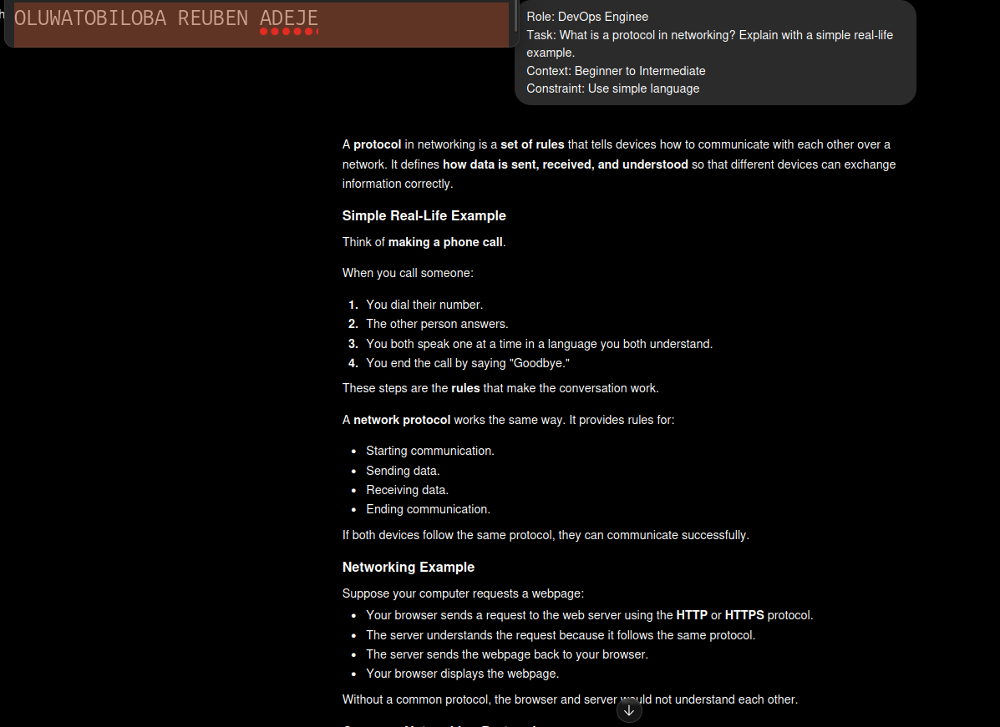
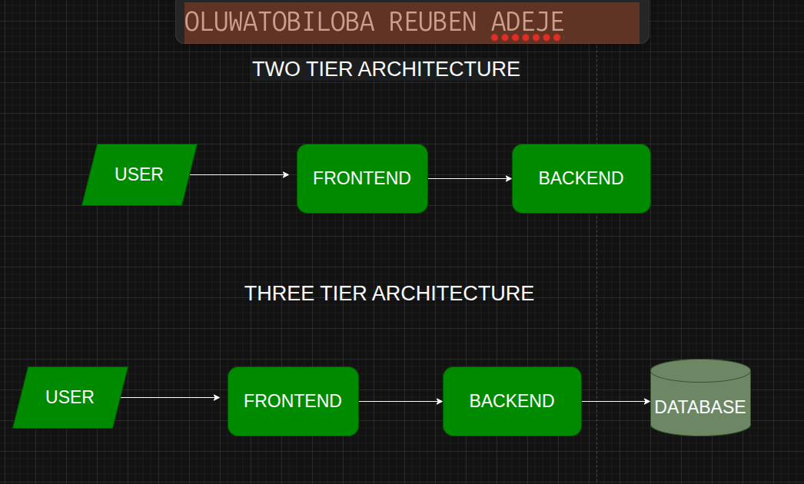
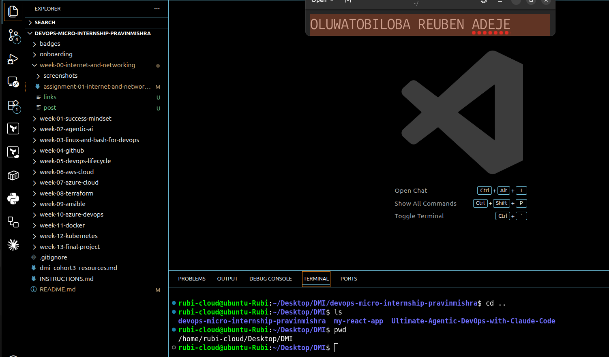

# Week 00 - Internet and Networking

Part of the DevOps Micro Internship (DMI) Cohort 3 with Agentic AI

---

# 🧑‍💻 Task 1: Using ChatGPT as Your Learning Assistant

## Scenario

You're new to DevOps and will frequently encounter technical questions. ChatGPT can be your learning companion.

## Your Task

Write a clear ChatGPT prompt to help you understand:

> "What is a protocol in networking? Explain with a simple real-life example."
 

Take a screenshot of your interaction showing:

* Your detailed prompt (with clear expectations)
* ChatGPT's simplified response with an example

## Screenshot

Save your screenshot in the `screenshots` folder and update the file name below.




Replace `task-1-chatgpt.png` with your actual screenshot file name.

---

## What I Learned (2–3 lines)

I learned how to write effective prompts in ChatGPT like a DevOps engineer to better understand networking concepts. By asking clear, specific questions, I was able to learn how network protocols such as DNS, TCP/IP, HTTP/HTTPS, IP addressing, and packet switching work together to enable reliable communication over the internet. 

---

# 🌐 Task 2: Internet and Networking

## Scenario

Your friend is launching an online bookstore named **EpicReads**.

He asked you to explain how users globally can access his website hosted in Finland.

## Your Task

Write a short explanation (**100–150 words**) that includes:

* Packet Switching
* IP Address
* TCP/IP
* HTTP/HTTPS

💡 **Tip:** You may use ChatGPT (as demonstrated in Task 1) to refine your explanation.

## Answer

When a user anywhere in the world visits **EpicReads**, they type the website name into their browser. The **DNS (Domain Name System)** translates the domain name into the server's **IP Address**, allowing the browser to locate the website hosted in Finland. The browser then sends a request using **HTTP** or **HTTPS**, with HTTPS providing a secure, encrypted connection. Communication takes place through the **TCP/IP** protocol suite, where **TCP** ensures the data is delivered accurately and in the correct order, while **IP** routes the data to the correct destination. The data is transmitted using **Packet Switching**, which breaks it into small packets that can travel along different network paths before being reassembled at the user's device. Together, DNS, TCP/IP, HTTP/HTTPS, IP addresses, and packet switching enable users worldwide to access EpicReads quickly, reliably, and securely.


---

# 🏗️ Task 3: Application Architecture & Stack

## Scenario

EpicReads bookstore has two application versions:

### Two-Tier Application

* Frontend
* Database

### Three-Tier Application

* Frontend
* Backend
* Database

## Your Task

* Draw simple diagrams (hand-drawn or tool-based such as draw.io)
* Label each layer clearly
* List at least two common technologies or tools used for each layer
* Submit a screenshot or photo clearly showing your own drawing

## Diagram Screenshot / Photo

Save your diagram image in the `screenshots` folder and update the file name below.




Replace `task-3-diagram.png` with your actual diagram file name.

---

## Technologies Used

### Frontend

* React, Angular (for web)
* Axios (for making API request)


### Backend

* Node.js, Express.js
* CORS 


### Database

* MySQL, PostgreSQL
* MongoDB


---

# 🌍 Task 4: Domain Name & DNS (Basic Concepts)

## Scenario

Your friend's bookstore **EpicReads** is currently accessible through:

```text
52.172.142.222:3000
```

He purchased the domain:

```text
epicreads.com
```

## Your Task

In **50–100 words**, explain in your own words:

1. What is DNS (Domain Name System)?
2. Which DNS record type should be used to connect the domain to the given IP, and why?

## Answer

DNS is like a phonebook. It translates human-friendly domain names, like epicreads.com, into IP addresses, such as (52.172.142.222:3000), so computers can find the website. To connect the domain to the IP, you use an A record, which maps the domain directly to the server’s IPv4 address. This is like writing your friend’s phone number next to their name. When someone types epicreads.com, the A record tells the browser the exact IP to reach, letting the website open correctly without needing to remember the numeric address.

---

# 💻 Task 5: Visual Studio Code Setup (Hands-on)

## Your Task

Install Visual Studio Code (if not already installed).

Take a screenshot of your VS Code environment showing:

* Terminal open inside VS Code
* Running a basic command:

### Windows

```powershell
dir
```

### Linux / macOS

```bash
pwd
ls
```

* Your selected VS Code theme clearly visible

⚠️ **Important:** The screenshot must show your username or another identifiable detail to confirm it is your environment.

## Screenshot

Save your screenshot in the `screenshots` folder and update the file name below.




Replace `task-5-vscode.png` with your actual screenshot file name.

---

# 🔗 Task 6: Publish Your Assignment as a LinkedIn Post

## Objective

Publishing on LinkedIn helps you:

* Build your professional online presence
* Reinforce your learning
* Document your DevOps journey publicly

## Your Task

Summarize your answers from Tasks 1–5 into a LinkedIn post.

Clearly structure your post into the following sections:

* ChatGPT
* Internet & Networking
* App Architecture
* DNS
* VS Code Setup

Add the following credit note at the end of your post:

> **P.S. This post is a part of DevOps Micro Internship with Agentic AI Cohort-3 by Pravin Mishra. You can start your DevOps journey by joining this Discord community: https://discord.pravinmishra.com/**

---

## LinkedIn Post URL

Paste your LinkedIn post URL here:

```text
https://www.linkedin.com/posts/oluwatobiloba-adeje-2572b42a6_join-the-dmi-devops-micro-internship-activity-7485219046620262400-0D-C?utm_source=share&utm_medium=member_desktop&rcm=ACoAAEm6D2MBiHlTtqXxAdNL2_2Taiskof8w_Lw
```

---

## LinkedIn Post Backup Copy

Paste the full text of your LinkedIn post here:

"You can't troubleshoot what you don't understand. For a DevOps Engineer, networking isn't optional, it's the foundation behind every deployment, API call, and cloud service." 

This week, I strengthened my understanding of networking by exploring how the core concepts work together in a real-world scenario using ChatGPT as a learning companion to break down complex networking concepts. Instead of memorizing definitions, I wanted to undestand how everything works together behind the scenes. 

Using an online bookstore called EpicReads as an example, I learned that:

🌐 DNS (Domain Name System) translates a domain name like epicreads.com into an IP address so browsers know where to send requests.

📍 Every server has an IP Address, which uniquely identifies it on the internet.

📦 Packet Switching breaks data into small packets that can travel through different routes before being reassembled at the destination.

🔗 The TCP/IP protocol suite ensures data is routed correctly (IP) and delivered reliably and in the correct order (TCP).

🔒 HTTP and HTTPS are the protocols browsers use to communicate with web servers, with HTTPS providing encryption for secure communication.

One concept I found especially interesting was the DNS A record, which maps a domain name directly to a server's IPv4 address, making it possible for users to access a website using a memorable name instead of a numeric IP address.

This learning experience also reinforced the importance of asking the right questions. Breaking complex topics into practical scenarios made it much easier to connect the dots and understand how these technologies work together behind the scenes.

The more I learn about networking, the more I realize it's one of the most important skills for anyone building a career in DevOps, Cloud Engineering, or Site Reliability Engineering.

What's the most underrated networking concept every DevOps Engineer should master?

P.S. This post is a part of DevOps Micro Internship with Agentic AI Cohort-3 by Pravin Mishra. You can start your DevOps journey by joining this Discord community: https://discord.pravinmishra.com


#DevOps #Networking #DNS #TCPIP #HTTP #HTTPS #PacketSwitching #CloudComputing #LearningInPublic #TechEducation #ChatGPT

---

# Reflection – Week 0

### What did you find easy?

I found that learning individual networking concepts was easy. Understanding what DNS, HTTP/HTTPS, TCP/IP, IP addresses, and Packet Switching do on their own wasn't the hard part.

---

### What was difficult?

One things I found most difficult was understanding how all the networking concepts fit together. I could memorize terms like DNS, TCP/IP, HTTP, and IP addresses, but I struggled to visualize what actually happens when someone types a website address into a browser.

---

### What will you improve next week?

Next, I want to dive deeper into what happens after the request reaches the server—exploring reverse proxies (Nginx), load balancers, firewalls, and how cloud networking ties everything together in AWS.

---

## 📌 About DMI & CloudAdvisory

DevOps Micro Internship (DMI) is a project-based DevOps program run by Pravin Mishra (The CloudAdvisory) focused on real-world execution, systems thinking, and career readiness.

It helps learners build strong DevOps foundations with hands-on experience.


## 📌 Resources

- 🌐 **DMI Official Website:** https://pravinmishra.com/dmi  
- 🎓 **DevOps for Beginners (Udemy):** https://www.udemy.com/course/devops-for-beginners-docker-k8s-cloud-cicd-4-projects/  
- 🎓 **Ultimate Agentic AI DevOps with Clude Code** https://www.udemy.com/course/ultimate-agentic-ai-devops-with-claude-code/?referralCode=448389767BC96284087B
- 🎓 **DevOps with Claude Code: Terraform, EKS, ArgoCD & Helm** https://www.udemy.com/course/devops-with-claude-code-terraform-eks-argocd-helm/?referralCode=1C5B734505D65A010FA3
- ▶️ **YouTube Playlist (DMI Cohort 3):** https://www.youtube.com/playlist?list=PLFeSNDtI4Cho  
- 🔗 **Pravin Mishra (LinkedIn):** https://www.linkedin.com/in/pravin-mishra-aws-trainer/  
- 🏢 **CloudAdvisory (LinkedIn):** https://www.linkedin.com/company/thecloudadvisory/

---

*This submission is part of DevOps Micro Internship (DMI) Cohort 3 — Agentic AI Track*