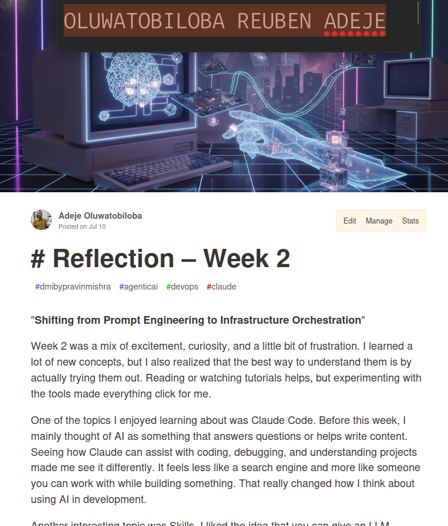
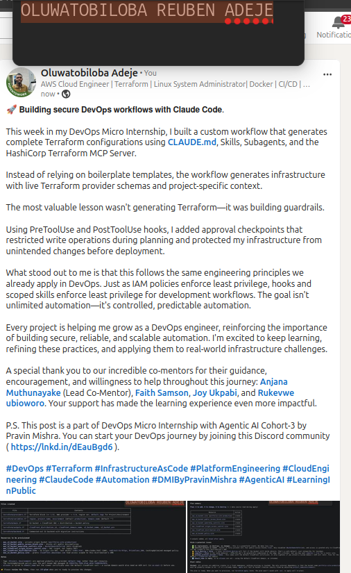

# Assignment 8 — Week 2 Reflection Blog

Part of the DevOps Micro Internship (DMI) Cohort 3 with Agentic AI

---

# Purpose

In this assignment, you will reflect on your Week 2 learning journey and write a short blog capturing your experience working with Agentic AI tools such as Claude Code, Skills, Subagents, MCP, Hooks, Permissions, and Memory.

You will also publish a LinkedIn post summarizing your learning and share both links for evaluation.

---

# Task 1 — Write Your Reflection Blog

## Goal

Write a reflection blog covering your Week 2 learning experience.

### Blog Requirements

Your blog must include:

* Title: **Reflection – Week 2**
* Minimum 300 words
* At least 2–3 topics from Week 2 (Claude Code, Skills, Subagents, MCP, Hooks, Permissions, Memory)
* Honest personal reflection (learning, challenges, mindset)
* One habit/system you plan to implement
* Your full name clearly visible

### Allowed Platforms

You can publish your blog on:

* Hashnode
* Medium
* Dev.to
* LinkedIn Article
* GitHub Markdown file
* Substack

---

### Evidence

#### Screenshot 1 — Blog published and visible



---

### Submission Field

Blog Link:

`https://dev.to/rubi_cloud/-reflection-week-2-4ach`

---

# Task 2 — Create LinkedIn Post

## Goal

Share your Week 2 learning publicly on LinkedIn.

---

### LinkedIn Post Requirements

Your post must include:

* One screenshot from any Week 2 assignment
* Short reflection (what you learned or built)
* Required P.S. line exactly as given below

---

### Required P.S. Line (Must Include Exactly)

> **P.S. This post is part of the DevOps Micro Internship (DMI) with Agentic AI — Cohort 3 — by [Pravin Mishra](https://www.linkedin.com/in/pravin-mishra-aws-trainer/). My graded progress is public: https://dmi.pravinmishra.com/s/YOUR-GITHUB-USERNAME.html · Start your DevOps journey: https://dmi.pravinmishra.com/?utm_source=student&utm_medium=ps-linkedin&utm_campaign=cohort3**

---

### Suggested Hashtags

#DMIByPravinMishra #AgenticAI #ClaudeCode #DevOps #LearningInPublic

---

### Evidence

#### Screenshot 2 — LinkedIn post published



---

### Submission Field

LinkedIn Post Content (copy-paste here):

```
🚀 𝗕𝘂𝗶𝗹𝗱𝗶𝗻𝗴 𝘀𝗲𝗰𝘂𝗿𝗲 𝗗𝗲𝘃𝗢𝗽𝘀 𝘄𝗼𝗿𝗸𝗳𝗹𝗼𝘄𝘀 𝘄𝗶𝘁𝗵 𝗖𝗹𝗮𝘂𝗱𝗲 𝗖𝗼𝗱𝗲.

This week in my DevOps Micro Internship, I built a custom workflow that generates complete Terraform configurations using CLAUDE.md, Skills, Subagents, and the HashiCorp Terraform MCP Server.

Instead of relying on boilerplate templates, the workflow generates infrastructure with live Terraform provider schemas and project-specific context.

The most valuable lesson wasn't generating Terraform—it was building guardrails.

Using PreToolUse and PostToolUse hooks, I added approval checkpoints that restricted write operations during planning and protected my infrastructure from unintended changes before deployment.

What stood out to me is that this follows the same engineering principles we already apply in DevOps. Just as IAM policies enforce least privilege, hooks and scoped skills enforce least privilege for development workflows. The goal isn't unlimited automation—it's controlled, predictable automation.

Every project is helping me grow as a DevOps engineer, reinforcing the importance of building secure, reliable, and scalable automation. I'm excited to keep learning, refining these practices, and applying them to real-world infrastructure challenges.

A special thank you to our incredible co-mentors for their guidance, encouragement, and willingness to help throughout this journey: Anjana Muthunayake (Lead Co-Mentor), Faith Samson, Joy Ukpabi, and Rukevwe ubioworo. Your support has made the learning experience even more impactful.

P.S. This post is a part of DevOps Micro Internship with Agentic AI Cohort-3 by Pravin Mishra. You can start your DevOps journey by joining this Discord community ( https://lnkd.in/dEauBgd6 ).
```

---

### LinkedIn Post Link:

`https://www.linkedin.com/posts/oluwatobiloba-adeje-2572b42a6_devops-terraform-infrastructureascode-ugcPost-7481296797525671937-n1hz/?utm_source=share&utm_medium=member_desktop&rcm=ACoAAEm6D2MBiHlTtqXxAdNL2_2Taiskof8w_Lw`

---

# Submission Instructions

* Blog must be publicly accessible
* LinkedIn post must be visible (public or unlisted where applicable)
* All required fields must be filled
* Screenshot proofs must be added to GitHub repository
* Do not include sensitive information in blog or post

---

# Completion Checklist

* [x] Blog written with required structure
* [x] Blog includes at least 2–3 Week 2 topics
* [x] Blog is publicly accessible
* [x] LinkedIn post created
* [x] Required P.S. line included
* [x] LinkedIn post content copied in submission field
* [x] Blog link added
* [x] LinkedIn post link added
* [x] Screenshots added to GitHub repo

---

# About DMI & CloudAdvisory

DevOps Micro Internship (DMI) is a project-based DevOps program run by Pravin Mishra (The CloudAdvisory), focused on real-world execution, systems thinking, and agentic AI workflows.

It helps learners build strong DevOps foundations through hands-on experience.

---

# Resources

* 🌐 DMI Official Website: [https://pravinmishra.com/dmi](https://pravinmishra.com/dmi)
* 🎓 DevOps for Beginners (Udemy): [https://www.udemy.com/course/devops-for-beginners-docker-k8s-cloud-cicd-4-projects/](https://www.udemy.com/course/devops-for-beginners-docker-k8s-cloud-cicd-4-projects/)
* 🎓 Agentic AI DevOps with Claude Code: [https://www.udemy.com/course/ultimate-agentic-ai-devops-with-claude-code/](https://www.udemy.com/course/ultimate-agentic-ai-devops-with-claude-code/)
* 🎓 DevOps with Claude Code: Terraform, EKS, ArgoCD & Helm: [https://www.udemy.com/course/devops-with-claude-code-terraform-eks-argocd-helm/](https://www.udemy.com/course/devops-with-claude-code-terraform-eks-argocd-helm/)
* ▶️ YouTube Playlist: [https://www.youtube.com/playlist?list=PLFeSNDtI4Cho](https://www.youtube.com/playlist?list=PLFeSNDtI4Cho)
* 🔗 Pravin Mishra (LinkedIn): [https://www.linkedin.com/in/pravin-mishra-aws-trainer/](https://www.linkedin.com/in/pravin-mishra-aws-trainer/)
* 🏢 CloudAdvisory (LinkedIn): [https://www.linkedin.com/company/thecloudadvisory/](https://www.linkedin.com/company/thecloudadvisory/)

