# Assignment 3 — Production Maintenance Drill (OPS Checklist)

Part of the DevOps Micro Internship (DMI) Cohort 3 with Agentic AI

---

## Purpose

In this assignment, you will treat your already deployed React application (on Ubuntu VM with Nginx) as a live production system. You will perform structured operational checks covering network validation, service health, log analysis, resource monitoring, configuration verification, and incident simulation with recovery — mirroring real on-call DevOps responsibilities.

---

# Task 1 — Server Access & Networking Validation

## Goal

Verify that the deployed React application is reachable from the browser and confirm basic network connectivity of the Ubuntu VM.

### Evidence

#### Screenshot 1 — Browser showing the React app with your Full Name visible on the UI

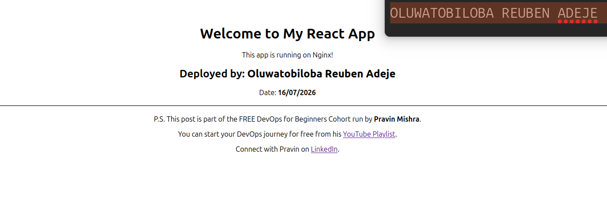

---

#### Screenshot 2 — Output of `ip a`

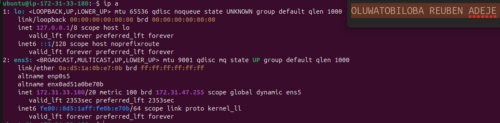

---

#### Screenshot 3 — Output of `sudo ss -tulpen`

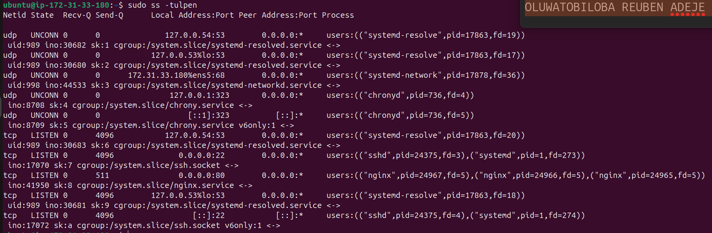

---

#### Screenshot 4 — Output of `sudo ufw status`

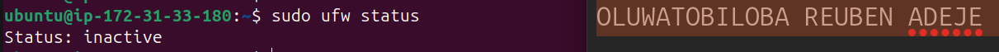
---

### Notes

Answer the following in your own words:

**1. What proves Nginx is listening on 0.0.0.0:80?**

The proof that nginx is listening on 0.0.0.0:80 is verified when the socket statistic command was run (sudo ss -tulpen), this command display key information which are:

- The State (LISTEN): This confirms the port is actively open and waiting for incoming network connections.
- The Process Name (nginx): This clearly links the open port to the Nginx software application.
- Address (0.0.0.0:80): This shows the service is bound to port 80 across all available IPv4 network interfaces.

---

**2. What proves SSH is active on port 22?**

The proof that SSH is active on 22 is verified when the socket statistic command was run (sudo ss -tulpen), this command display key information which are:

- The State (LISTEN): This confirms the port is actively open and waiting for incoming network connections.
- The Process Name (nginx): This clearly links the open port to the Nginx software application.
- Address (0.0.0.0:80): This shows the service is bound to port 80 across all available IPv4 network interfaces.

---

**3. Did you find any unexpected open ports? Explain briefly.**

Yes, I found port 53 which is used by DNS to resolve domain name to IP address

---

# Task 2 — Service Health & Systemd Validation (Nginx)

## Goal

Verify that Nginx is properly installed, running, enabled at boot, and safely configured.

### Evidence

#### Screenshot 1 — Output of `systemctl status nginx --no-pager`

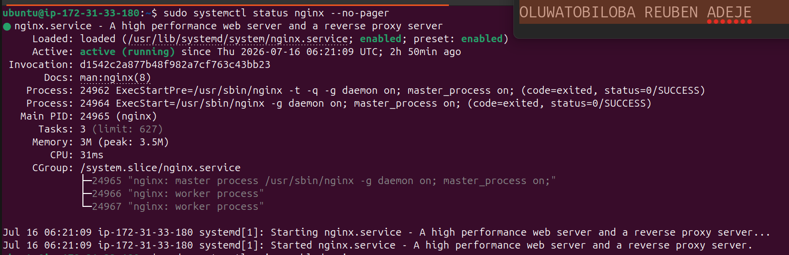

---

#### Screenshot 2 — Output of `sudo nginx -t`

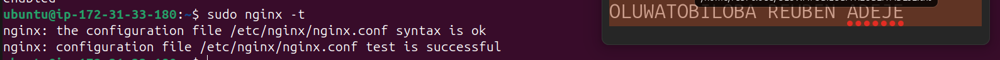

---

#### Screenshot 3 — Output of `sudo ss -lptn '( sport = :80 )'`

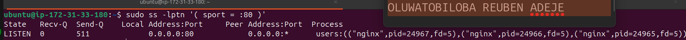
---

### Notes

Answer the following in your own words:

**1. What happens if Nginx fails to restart in production?**

if Nginx fails to restart, the web server may stop serving requests (depending on how the restart was attempted), which can result in downtime because port 80/443 will be inactive or dead and users will see "Connection Refused" or 502 Bad Gateway or 504 Gateway Timeout errors

---

**2. What's your basic rollback plan?**

As a DevOps engineer working in production environment, my first step is to:

#### Check why Nginx failed

- sudo nginx -t
- sudo systemctl status nginx
- sudo journalctl -u nginx --no-pager -n 50

#### Restore the last known good configuration

- sudo cp /etc/nginx/nginx.conf.bak /etc/nginx/nginx.conf

#### Test the restored configuration

- sudo nginx -t

#### Reload or start Nginx

- systemctl reload nginx

#### Verify the application is healthy

After verifying that the application is healthy and production can continue, I will troubleshoot the root couse of the initial failure by checking and monitoring log files using the following command:

- sudo tail -f /var/log/nginx/error.log
- sudo tail -f /var/log/nginx/access.log
- sudo journalctl -u nginx -f 
- sudo journalctl -u nginx -p err
  
---

# Task 3 — Logs & Request Trace

## Goal

Verify real traffic flow and analyze logs to understand system behavior and errors.

### Evidence

#### Screenshot 1 — Output of `sudo tail -n 30 /var/log/nginx/access.log`

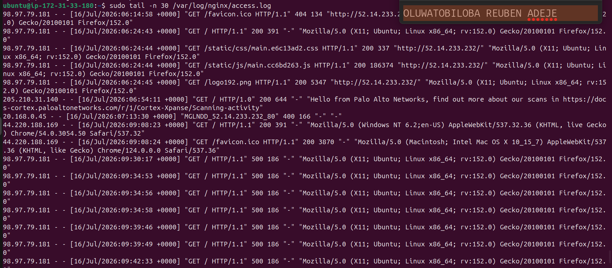

---

#### Screenshot 2 — Output of `sudo tail -n 30 /var/log/nginx/error.log`

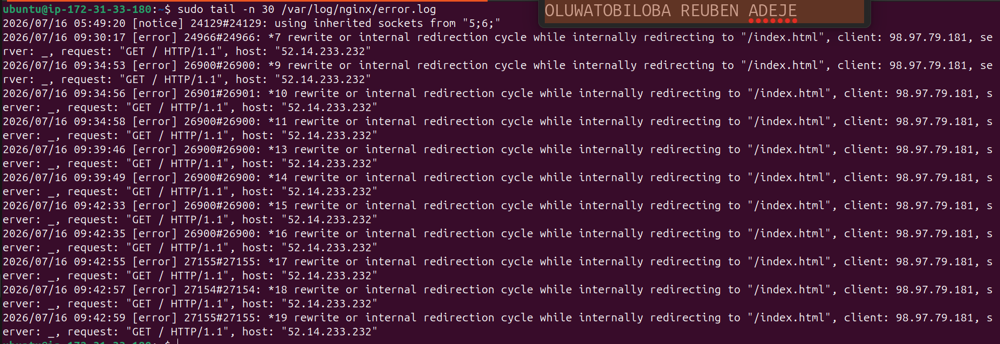

---

#### Screenshot 3 — Output of `sudo journalctl -u nginx --no-pager -n 50`

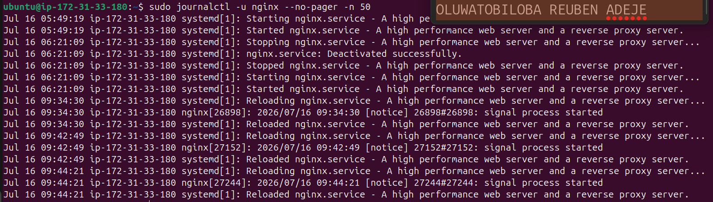

---

### Notes

Answer the following in your own words:

**1. Were there any errors in the logs?**

- If yes, mention 1–2 example error lines from the logs and explain what each one means in simple terms.
- If no, explain what it means if the error log is empty or shows no recent errors during your check.

`Yes`

**The eror encoutered is internal redirection cycle while internally redirecting to "/index.html"**. This 
 error means while nginx is trying to redirect incoming traffic according to the default configuration in /etc/nginx/site-available/default to the root `/var/www/html/`, index.html is not found.

---

**2. If there were no errors, what does that indicate about the system?**

If there are no log errors, it suggests that Nginx is operating normally and hasn't encountered any issues significant enough to log. 

---

**3. Based on the access logs, were your curl requests visible in the log entries? What does that prove about traffic flow?**

Yes. My curl requests were visible in the Nginx access logs. This confirmed that the requests successfully reached the Nginx server, were processed, and received a response. The presence of HTTP status codes such as 200 OK also verified that traffic was flowing correctly from the client to the server and that Nginx was serving the application as expected.

---

# Task 4 — System Resource Health Check (Capacity Red Flags)

## Goal

Assess server capacity and detect potential performance or failure risks.

### Evidence

#### Screenshot 1 — Output of `uptime`

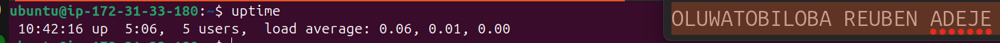

---

#### Screenshot 2 — Output of `free -h`

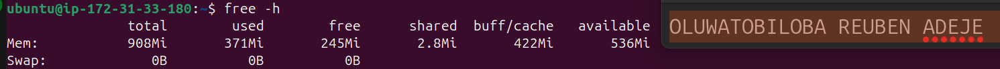

---

#### Screenshot 3 — Output of `df -h`

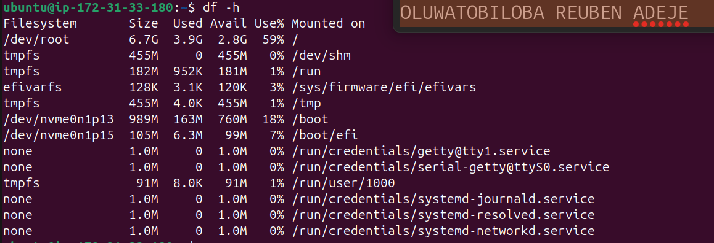

---

#### Screenshot 4 — Output of `sudo du -sh /var/* | sort -h`

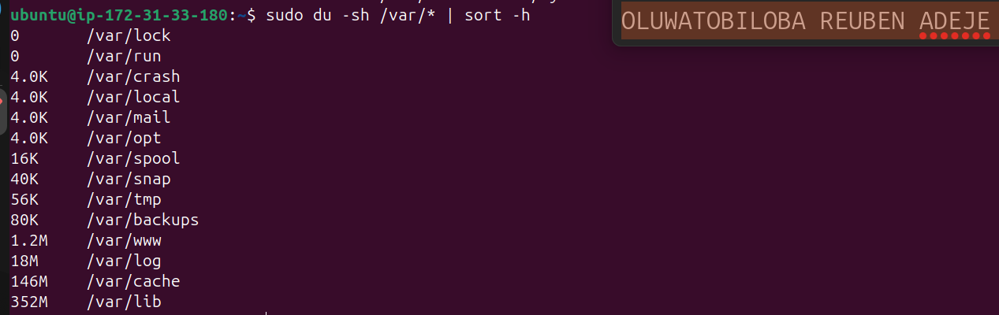

---

### Notes

Answer the following in your own words:

**1. Which resource looks most critical right now? (CPU/load, memory, or disk) Explain why.**

No resource look critical because the disk is only 59% utilized, memory has 536 MB available, CPU load is 0.00, and log files are small, so there are no immediate resource concerns. The server appears healthy and operating normally.

---

**2. What happens if disk becomes 100% full in a production server?**

If a production server's disk reaches 100%, applications may no longer be able to write logs, temporary files, or user data. Nginx may stop logging requests, databases can fail to process writes, and users may receive 500 errors or experience service outages.

---

# Task 5 — Configuration & Deployment Verification

## Goal

Ensure the correct React build is deployed and Nginx is serving it properly.

### Evidence

#### Screenshot 1 — Output of `ls -lah /var/www/html | head -n 20`

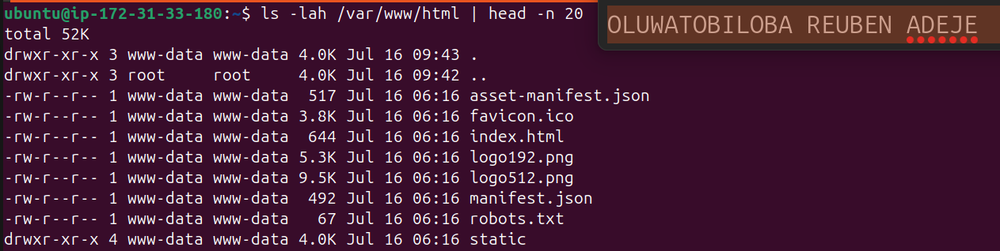

---

#### Screenshot 2 — Output of `grep -R "Deployed by" -n /var/www/html 2>/dev/null | head`

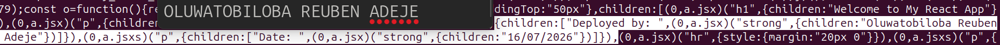

---

#### Screenshot 3 — Output of `grep -n "try_files" /etc/nginx/sites-available/default`

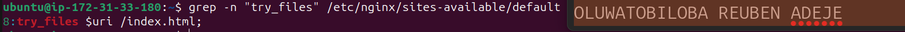

---

### Notes

Answer the following in your own words:

**1. How do you confirm that the correct version of the application is deployed?**

To confirm that the correct version of the application was deployed, I performed several verification steps. First, I checked the deployment directory using ls -lah /var/www/html to ensure the expected files were present. I verified that the React production build files, including index.html and the static folder, existed in the web root.

Next, I confirmed that my specific code changes were deployed by opening the application files and verifying that the custom text, such as "Deployed by <Oluwatobiloba Reuben Adeje>", was present. This ensured that the latest build had been deployed rather than an older version.

I also verified that Nginx was configured to serve the application from the correct web root (/var/www/html) by reviewing the Nginx configuration. Finally, I accessed the application in a web browser to ensure it loaded successfully and displayed the expected changes. This end-to-end verification confirmed that the correct version of the application was deployed and being served correctly by Nginx.

---

# Task 6 — Nginx Configuration Failure Simulation

## Goal

Simulate a real-world Nginx misconfiguration and recover the service safely.

### Evidence

#### Screenshot 1 — Output of `sudo nginx -t` showing the syntax error (broken config)

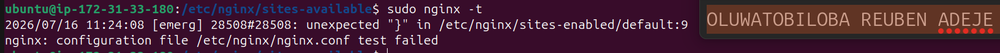

---

#### Screenshot 2 — Output of `sudo nginx -t` showing syntax ok (fixed config)

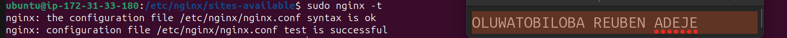

---

#### Screenshot 3 — Output of `curl -I http://<public-ip>` confirming recovery (200 OK)

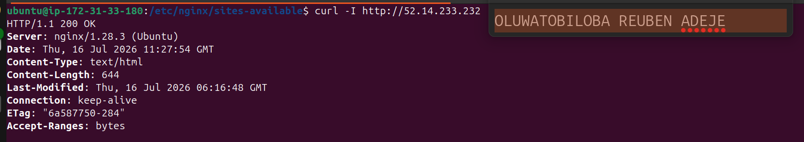

---

### Notes

Answer the following in your own words:

**1. What caused the configuration failure?**

The nginx default configuration file located in /etc/nginx/site-available was missing a character ";" in its location block.

---

**2. How did you fix the issue?**

I edited the the nginx configuration file by using this command `sudo nano /etc/nginx/site-available/default` and format the location block by replacing the missing character.

Then I validated nginx configuration again using `sudo nginx -t`

---

**3. How can you avoid this kind of issue in real production systems?**

A missing semicolon in an Nginx configuration is a syntax error that can prevent Nginx from reloading successfully. In production, I would avoid this by always running nginx -t before reloading the service. I would use `sudo nginx -t && systemctl reload nginx` so that an invalid configuration is never applied. I would also keep configuration backups, store configuration files in Git, have changes reviewed through a pull request process, and include nginx -t as a validation step in the CI/CD pipeline.

---

# Task 7 — Web Application Failure Simulation

## Goal

Simulate missing deployment content and recover the application safely.

### Evidence

#### Screenshot 1 — Output of `curl -I http://<public-ip>` showing failure (non-200 response)

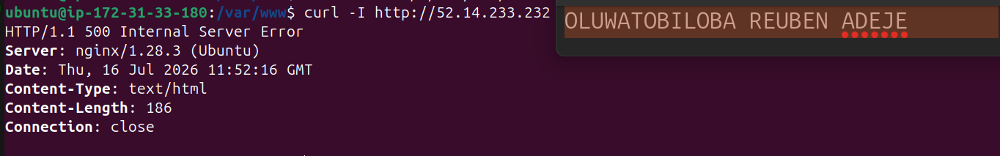

---

#### Screenshot 2 — Output of `curl -I http://<public-ip>` confirming recovery (200 OK)

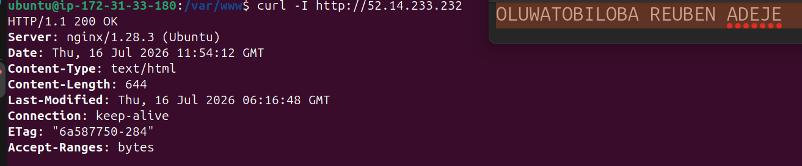
---

### Notes

Answer the following in your own words:

**1. What caused the application to break in this scenario?**

The React Application web content directory located at /var/www/html was missing.

---

**2. How did you fix the issue and restore the application?**

I began troubleshooting by verifying the server's reachability using the curl -I command. The response returned an HTTP/1.1 500 Internal Server Error with Connection close, indicating that the server was reachable but the application or web server configuration was encountering an internal issue.

To restore service quickly, I reverted to the last known good state by restoring the backed-up web content directory. After the rollback, I restarted the Nginx service and verified that it started successfully. Finally, I confirmed the application was accessible by sending another curl request and loading the application in a web browser to ensure it was serving the expected content.

---

**3. What steps would you take to prevent this kind of issue in real production systems?**

To prevent this type of issue in a real production environment, I would implement several best practices. First, I would test the application in a staging environment before deploying it to production. Before replacing the web content, I would create a backup of the current deployment to enable a quick rollback if needed.

I would validate the deployment by checking that all required application files are present and verifying that the correct version has been deployed. Before reloading Nginx, I would run nginx -t to ensure the configuration is valid. After deployment, I would perform health checks using curl -I or application-specific endpoints to confirm the service is responding correctly.

---

# Task 8 — Security & Reliability Review

## Goal

Review and reflect on the security and reliability practices applied during this assignment.

### Security & Reliability Notes

Answer the following in your own words:

**1. Why is SSH key-based authentication more secure than sharing passwords?**

SSH key-based authentication is more secure than password authentication because it uses a pair of cryptographic keys, a private key stored securely on the user's device and a public key stored on the server. Since the private key is never transmitted over the network, it is highly resistant to interception, brute-force attacks, and password guessing.

In contrast, passwords can be weak, reused across multiple systems, or accidentally shared. SSH keys are long, randomly generated, and extremely difficult to crack. They can also be protected with a passphrase for an additional layer of security.

In production environments, SSH keys are easier to manage because administrators can grant or revoke access by adding or removing a user's public key without affecting other users. This makes SSH key-based authentication both more secure and more efficient for managing server access.

---

**2. Why should only required ports be open on a production server?**

Only required ports should be open because every open port increases the server's attack surface. Limiting access to only essential services, such as ports 80 and 443 for web traffic and restricting SSH access, reduces the risk of unauthorized access, exploits, and network attacks. This follows the principle of least privilege and is a security best practice for production servers.

---

**3. Why is it important for Nginx to be enabled on boot?**

Nginx should be enabled on boot so it starts automatically whenever the server restarts. This minimizes downtime, ensures the web application is immediately available after maintenance or unexpected reboots, and eliminates the need for manual intervention, which is essential for maintaining reliability in production environments.

---

**4. What are the risks of sharing secrets, keys, or credentials publicly?**

Sharing secrets, keys, or credentials publicly can allow attackers to gain unauthorized access to servers, cloud resources, or applications. This can result in data breaches, service disruptions, and financial loss. In production environments, secrets should be stored securely using secret management tools or environment variables, never committed to source code, and rotated immediately if they are accidentally exposed.

---

**5. Why should cloud resources be stopped or terminated when they are no longer needed?**

Cloud resources should be stopped or terminated when they are no longer needed to avoid unnecessary costs, reduce security risks, and optimize resource usage. Regularly cleaning up unused resources helps maintain an efficient, secure, and cost-effective cloud environment.

---

# LinkedIn Post (Required)

## Evidence

#### LinkedIn Post URL

Paste your LinkedIn post URL here:

`https://www.linkedin.com/posts/oluwatobiloba-adeje-2572b42a6_devops-aws-linux-ugcPost-7483772856888115200-FqwQ/?utm_source=share&utm_medium=member_desktop&rcm=ACoAAEm6D2MBiHlTtqXxAdNL2_2Taiskof8w_Lw`

---

#### Screenshot — Published LinkedIn post

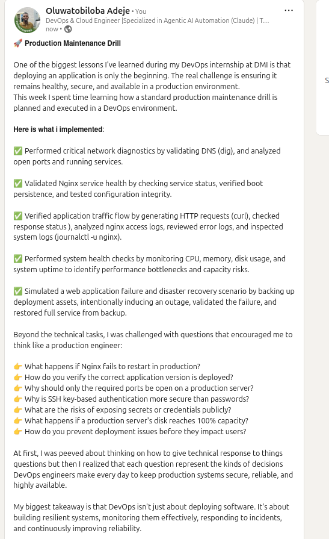

---

# Submission Instructions

- Add all required screenshots in your submission
- Full name must be visible in required screenshots
- Do not expose sensitive information (keys, passwords, account IDs)

---

# Completion Checklist

- [x] Task 1: Screenshots (browser, ip a, ss -tulpen, ufw status) + Notes answered
- [x] Task 2: Screenshots (nginx status, nginx -t, ss port 80) + Notes answered
- [x] Task 3: Screenshots (access log, error log, journalctl) + Notes answered
- [x] Task 4: Screenshots (uptime, free -h, df -h, du -sh) + Notes answered
- [x] Task 5: Screenshots (ls html, grep deployed by, grep try_files) + Notes answered
- [x] Task 6: Screenshots (nginx -t fail, nginx -t pass, curl recovery) + Notes answered
- [x] Task 7: Screenshots (curl failure, curl recovery) + Notes answered
- [x] Task 8: Security & Reliability Notes answered
- [x] LinkedIn post published and URL submitted
- [x] Full Name visible in all required screenshots
- [x] No sensitive data exposed

---

## 📌 About DMI & CloudAdvisory

DevOps Micro Internship (DMI) is a project-based DevOps program run by Pravin Mishra (The CloudAdvisory) focused on real-world execution, systems thinking, and career readiness.

It helps learners build strong DevOps foundations with hands-on experience.

---

## 📌 Resources

- 🌐 DMI Official Website: https://pravinmishra.com/dmi  
- 🎓 DevOps for Beginners (Udemy): https://www.udemy.com/course/devops-for-beginners-docker-k8s-cloud-cicd-4-projects/  
- 🎓 Agentic AI DevOps with Claude Code: https://www.udemy.com/course/ultimate-agentic-ai-devops-with-claude-code/  
- 🎓 DevOps with Claude Code: Terraform, EKS, ArgoCD & Helm: https://www.udemy.com/course/devops-with-claude-code-terraform-eks-argocd-helm/  
- ▶️ YouTube Playlist: https://www.youtube.com/playlist?list=PLFeSNDtI4Cho  
- 🔗 Pravin Mishra (LinkedIn): https://www.linkedin.com/in/pravin-mishra-aws-trainer/  
- 🏢 CloudAdvisory (LinkedIn): https://www.linkedin.com/company/thecloudadvisory/

---

*This submission is part of DevOps Micro Internship (DMI) Cohort 3 — Agentic AI Track.*