# Assignment 5 — Bash Script Automation Drill (OPS Checklist)

Part of the DevOps Micro Internship (DMI) Cohort 3 with Agentic AI

---

## Purpose

In this assignment, you will practice Bash scripting by building a series of small automation scripts covering environment setup, variables, arrays, loops, file conditionals, if-else logic, and functions. These scripts form the foundation of real-world Linux automation used in DevOps, cloud, and production support environments.

---

# Task 1 — Bash Environment & Workspace Setup

## Goal

Verify that Bash is available on your system and create a clean workspace for this assignment.

### Evidence

#### Screenshot 1 — Output of `echo $SHELL` and `bash --version`

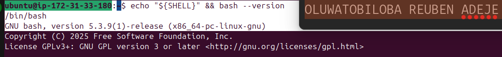

---

#### Screenshot 2 — Output of `pwd` and `ls -lah` showing the scripts directory

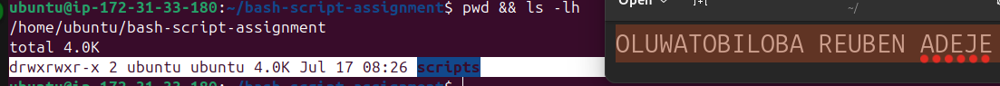

---

### Notes

Answer the following in your own words:

**1. What is Bash?**

Bash is an acronym meaning Bourne Again Shell. It is a command-line interpreter and the default shell for most Unix computers. 

---

**2. What is the difference between shell and Bash?**

A shell is the outer layer of the operating system. It takes command from the user and translate it into a form that the kernel can understand.

Bash is simply one of the most famous type of shell.

---

**3. Why is it important to confirm the Bash version before writing scripts?**

Confirming the Bash version ensures your script uses features supported by the installed shell. Different Bash versions have different capabilities and syntax. Checking the version helps avoid compatibility issues and runtime errors, making your scripts more portable and reliable.

---

# Task 2 — Your First Bash Script

## Goal

Create your first Bash script, make it executable, and run it from the terminal.

### Evidence

#### Screenshot 1 — Content of `first-script.sh`

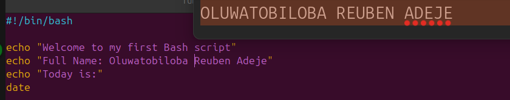

---

#### Screenshot 2 — Output of `./first-script.sh`

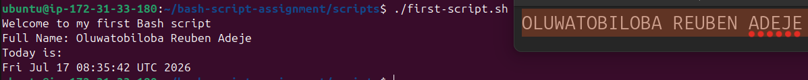

---

#### Screenshot 3 — Output of `ls -l first-script.sh` showing executable permission

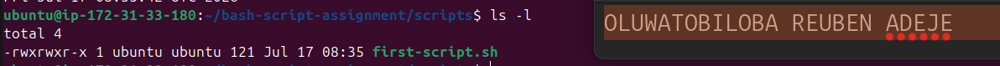

---

### Notes

Answer the following in your own words:

**1. What is the purpose of `#!/bin/bash`?**

#!/bin/bash is called a shebang. It tells the operating system to execute the script using the Bash shell. This ensures the script runs with Bash, even if the user's default shell is different.

---

**2. Why do we use `chmod +x` before running a script?**

chmod +x gives a script execute permission. This allows the operating system to run the file as a program. 

---

**3. What is the difference between running a script using `./script.sh` and `bash script.sh`?**

./script.sh runs the script as an executable and requires execute permission (chmod +x). It also uses the interpreter specified in the shebang (#!/bin/bash). while the bash script.sh runs the script directly with the Bash interpreter and does not require execute permission. 

---

# Task 3 — Variables: User Information Script

## Goal

Use variables to store and display user-related information.

### Evidence

#### Screenshot 1 — Content of `user-info.sh`

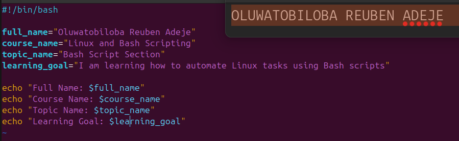

---

#### Screenshot 2 — Output of `./user-info.sh`

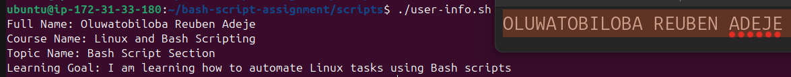

---

### Notes

Answer the following in your own words:

**1. What is a variable in Bash?**

A variable in Bash is a named storage location used to hold data, such as text or numbers. It is used to store and reuse values throughout a script.

---

**2. Why should we avoid spaces around the `=` sign when creating variables?**

In Bash, spaces around the = sign are not allowed when assigning variables because Bash interprets spaces as separate arguments, causing an error

---

**3. How do you access the value stored inside a Bash variable?**

The value stored in a variable can be access by placing a $ sign before its name.

---

# Task 4 — Arrays & Loops: Tools Checklist Script

## Goal

Use arrays and loops to print a checklist of tools used in Bash scripting.

### Evidence

#### Screenshot 1 — Content of `tools-checklist.sh`

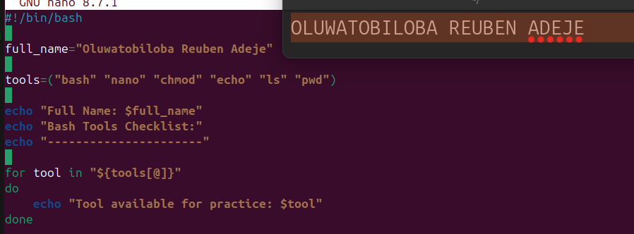

---

#### Screenshot 2 — Output of `./tools-checklist.sh`

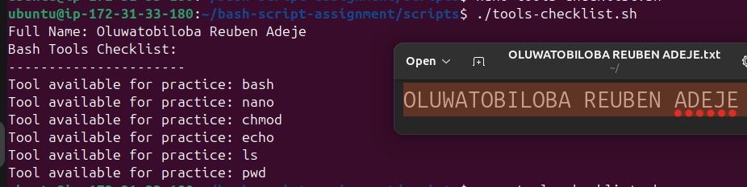

---

### Notes

Answer the following in your own words:

**1. What is an array in Bash?**

An array in Bash is a variable that can store multiple values under a single name.

---

**2. Why are arrays useful in scripts?**

Arrays are useful in Bash scripts because they allow you to store and manage multiple related values in a single variable.

---

**3. What does `"${tools[@]}"` mean?**

"${tools[@]}" refers to all elements of the array named tools. Each element is treated as a separate item, preserving spaces within individual elements.

---

**4. What is the purpose of the `for` loop in this script?**

The for loop is used to repeat a block of code for each item in a list or array

---

# Task 5 — Loops: Number Counter Script

## Goal

Use loops to repeat a task multiple times.

### Evidence

#### Screenshot 1 — Content of `counter.sh`

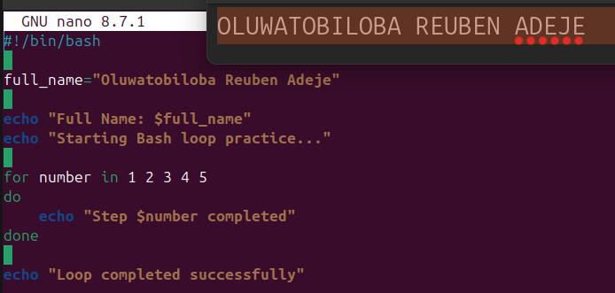

---

#### Screenshot 2 — Output of `./counter.sh`

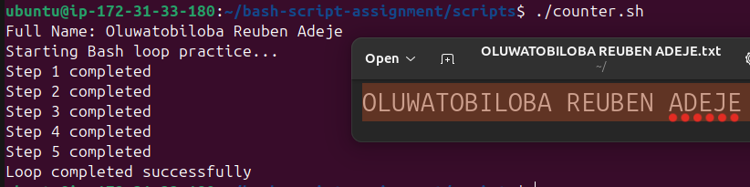

---

### Notes

Answer the following in your own words:

**1. What is a loop?**

A loop is a programming structure that repeatedly executes a block of code until a condition is met or all items in a list have been processed.

---

**2. Why do we use loops in Bash scripting?**

Loops are used in Bash scripting to repeat a set of commands automatically.

---

**3. How many times did the loop run in your script?**

The loop ran five times

---

**4. What would you change if you wanted the loop to run 10 times?**

I will increase the number of iteration from five (5) to ten (10)

---

# Task 6 — Files & Conditionals: File Validation Script

## Goal

Use file checks and conditionals to verify whether files and directories exist.

### Evidence

#### Screenshot 1 — Output of `ls -lah ../test-folder`

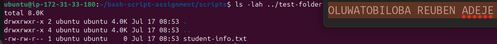

---

#### Screenshot 2 — Content of `file-check.sh`

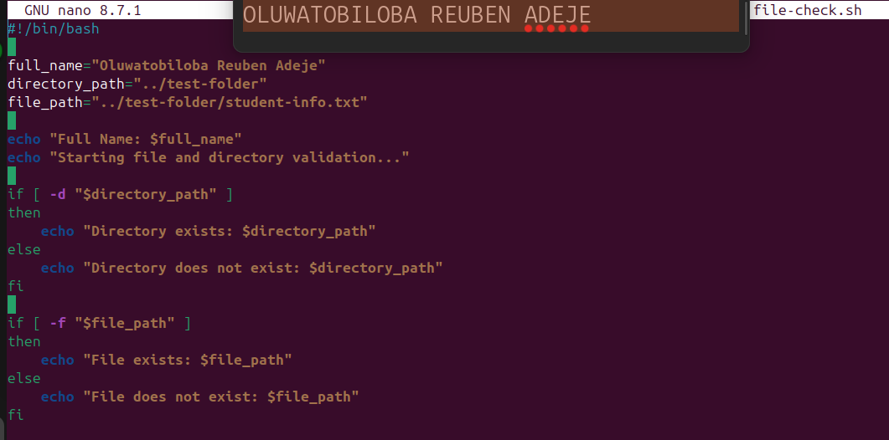

---

#### Screenshot 3 — Output of `./file-check.sh`

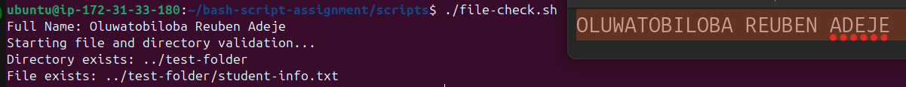

---

### Notes

Answer the following in your own words:

**1. What does `-d` check in Bash?**

The -d test checks whether a specified path exists and is a directory

---

**2. What does `-f` check in Bash?**

The -f test checks whether a specified path exists and is a regular file.

---

**3. Why should file and directory paths be stored in variables?**

Storing file and directory paths in variables makes scripts easier to read, update, and maintain. If a path changes, it will only be updated in one place instead of throughout the script. 

---

**4. What happens if the file does not exist?**

If the file does not exist, the -f test returns false. Any commands inside the if block will be skipped, and the else block (if present) will execute instead.

---

# Task 7 — Conditionals: Pass or Retry Script

## Goal

Use if-else conditionals to make decisions based on a variable value.

### Evidence

#### Screenshot 1 — Content of `score-check.sh` with `score=85`

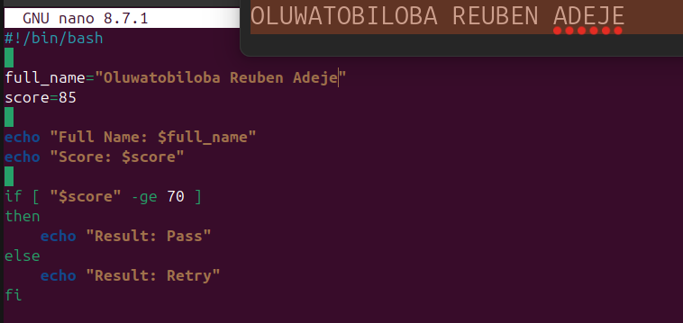

---

#### Screenshot 2 — Output showing `Result: Pass`

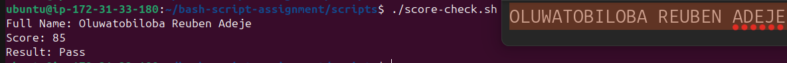

---

#### Screenshot 3 — Content of `score-check.sh` with `score=55`

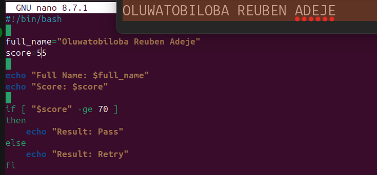

---

#### Screenshot 4 — Output showing `Result: Retry`

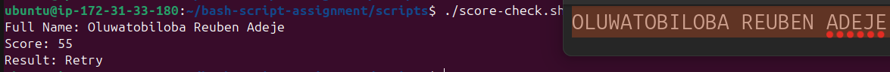

---

### Notes

Answer the following in your own words:

**1. What is the purpose of if-else in Bash?**

The if-else statement is used to make decisions in Bash scripts. It executes one block of code if a condition is true, and another block if the condition is false.

---

**2. What does `-ge` mean?**

The -ge operator means greater than or equal to. It is used to compare two integer values in Bash
---

**3. Why should conditions be tested with different values?**

Testing conditions with different values helps ensure the script works correctly in all situations. It verifies that both the true and false branches of the condition behave as expected and helps identify errors.
---

**4. How can conditionals help in automation scripts?**

Conditionals help automation scripts make decisions based on specific conditions. They allow the script to perform different actions depending on the input or system state, making automation more flexible and efficient.

---

# Task 8 — Functions: Final Bash Automation Script

## Goal

Create a final Bash script using functions to organize reusable code.

### Evidence

#### Screenshot 1 — Content of `final-automation.sh`

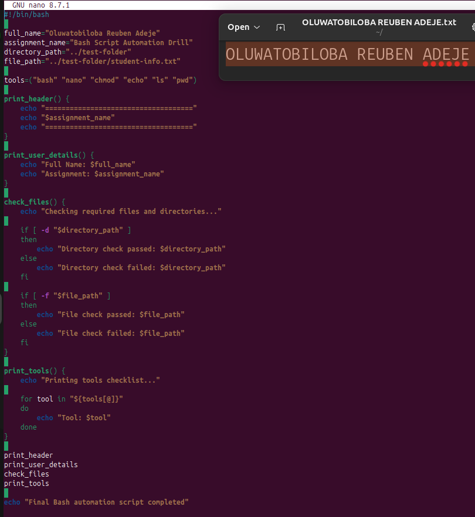

---

#### Screenshot 2 — Output of `./final-automation.sh`

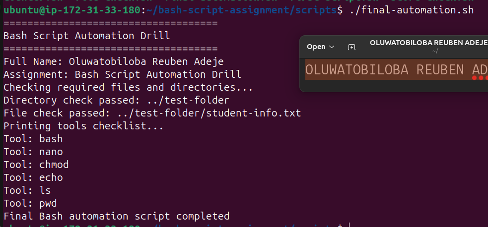

---

#### Screenshot 3 — Output of `ls -lah` showing all created scripts

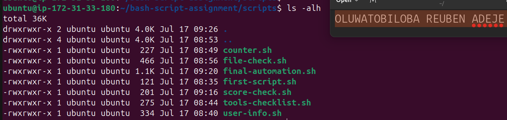

---

### Notes

Answer the following in your own words:

**1. What is a function in Bash?**

Functions in Bash are reusable blocks of code that perform a specific task. They help organize scripts, reduce code repetition, and make automation scripts easier to read, maintain, and debug.

---

**2. Why are functions useful in scripts?**

Functions are useful because they let you reuse code instead of writing the same commands multiple times. They make scripts more organized, easier to maintain, and simpler to debug.

---

**3. Which functions did you create in this script?**

- print_header ()
- print_user_details()
- check_files()
- print_tools()

---

**4. How does this final script combine variables, arrays, loops, conditionals, files, and functions?**

The final Bash script combines variables to store data, arrays to hold multiple values, loops to process each item, conditionals to make decisions, file checks to verify files or directories, and functions to organize reusable code. Together, these features create a structured, efficient, and automated script.

---

# LinkedIn Post (Required)

## Evidence

#### LinkedIn Post URL

Paste your LinkedIn post URL here:

<<<<<<< HEAD
`https://www.linkedin.com/posts/oluwatobiloba-adeje-2572b42a6_devops-linux-bash-activity-7483880740645060608-Nm9w?utm_source=share&utm_medium=member_desktop&rcm=ACoAAEm6D2MBiHlTtqXxAdNL2_2Taiskof8w_Lw`
=======
`Add your URL here`
>>>>>>> upstream/main

---

#### Screenshot — Published LinkedIn post

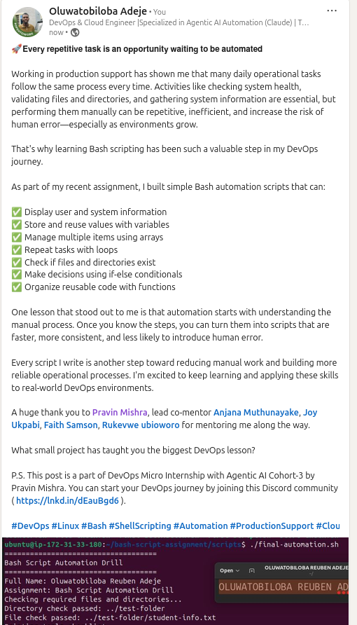

---

# Submission Instructions

- Add all required screenshots in your submission
- Full name must be visible in required screenshots
- All script files must be created and run successfully
- Required notes must be answered clearly for every task
- Do not expose sensitive information (keys, passwords, credentials)

---

# Completion Checklist

- [x] Task 1: Environment setup verified, workspace created (Screenshots 1–2, Notes answered)
- [x] Task 2: First script created, executed, permissions verified (Screenshots 1–3, Notes answered)
- [x] Task 3: Variables script created and run (Screenshots 1–2, Notes answered)
- [x] Task 4: Arrays and loops script created and run (Screenshots 1–2, Notes answered)
- [x] Task 5: Counter loop script created and run (Screenshots 1–2, Notes answered)
- [x] Task 6: File validation script created and run (Screenshots 1–3, Notes answered)
- [x] Task 7: Pass/Retry conditional script tested with both values (Screenshots 1–4, Notes answered)
- [x] Task 8: Final automation script created and run (Screenshots 1–3, Notes answered)
- [x] All scripts run without errors
- [x] Full Name visible in all required screenshots
- [x] LinkedIn post published and URL submitted
- [x] No sensitive data exposed

---

## 📌 About DMI & CloudAdvisory

DevOps Micro Internship (DMI) is a project-based DevOps program run by Pravin Mishra (The CloudAdvisory) focused on real-world execution, systems thinking, and career readiness.

It helps learners build strong DevOps foundations with hands-on experience.

---

## 📌 Resources

- 🌐 DMI Official Website: https://pravinmishra.com/dmi  
- 🎓 DevOps for Beginners (Udemy): https://www.udemy.com/course/devops-for-beginners-docker-k8s-cloud-cicd-4-projects/  
- 🎓 Agentic AI DevOps with Claude Code: https://www.udemy.com/course/ultimate-agentic-ai-devops-with-claude-code/  
- 🎓 DevOps with Claude Code: Terraform, EKS, ArgoCD & Helm: https://www.udemy.com/course/devops-with-claude-code-terraform-eks-argocd-helm/  
- ▶️ YouTube Playlist: https://www.youtube.com/playlist?list=PLFeSNDtI4Cho  
- 🔗 Pravin Mishra (LinkedIn): https://www.linkedin.com/in/pravin-mishra-aws-trainer/  
- 🏢 CloudAdvisory (LinkedIn): https://www.linkedin.com/company/thecloudadvisory/

---

*This submission is part of DevOps Micro Internship (DMI) Cohort 3 — Agentic AI Track.*