# Assignment 6 — Build an AI-Assisted Linux Health Check (AI-Assisted Linux Incident Triage)

Part of the DevOps Micro Internship (DMI) Cohort 3 with Agentic AI

---

## Purpose

In this assignment, you will build a read-only Bash triage script that checks the health of your Ubuntu server and Nginx application, connect it to Claude Code as a reusable `/linux-triage` skill, simulate a controlled Nginx incident, use the skill to gather and analyze evidence, recover the service manually, and verify recovery. The workflow follows the Agentic Loop: Gather → Analyze → Human Act → Verify.

---

# Task 1 — Confirm the Healthy Baseline and Create the Workspace

## Goal

Confirm that Nginx and the React application are healthy before building the automation.

### Evidence

#### Screenshot 1 — Output of `systemctl is-active nginx`, `ss -ltn | grep ':80'`, and `curl -I http://localhost`

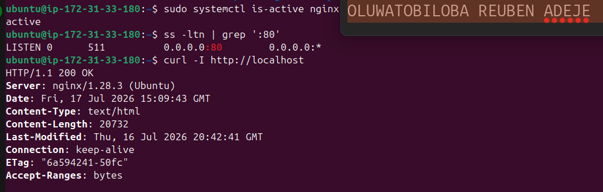

---

#### Screenshot 2 — Output of `pwd` and `find . -maxdepth 4 -type d | sort` showing the workspace folder structure

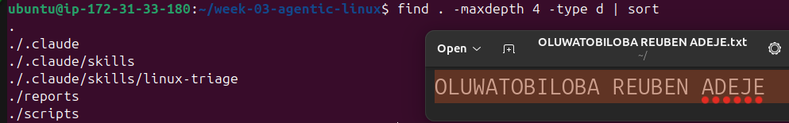

---

### Notes

Answer the following in your own words:

**1. What proves that Nginx is running?**

We can verify that NGINX is running by checking its service status with systemctl status nginx, which shows Active: active (running).

---

**2. What proves that the server is listening for HTTP traffic?**

The server is proven to be listening for HTTP traffic if it is listening on port 80, which can be verified using ss -tulpn command

---

**3. Why must you capture a healthy baseline before simulating an incident?**

Capturing a healthy baseline establishes the server's normal behavior before any changes are made. This makes it easier to identify the impact of the simulated incident, compare results, and verify that the system has been fully restored afterward.

---

# Task 2 — Create Project Context and Safety Rules in CLAUDE.md

## Goal

Tell Claude exactly what this project does and what it is not allowed to do.

### Evidence

#### Screenshot 3 — CLAUDE.md open in VS Code showing all four sections (Project Overview, Incident Workflow, Safety Rules, Output Rules)

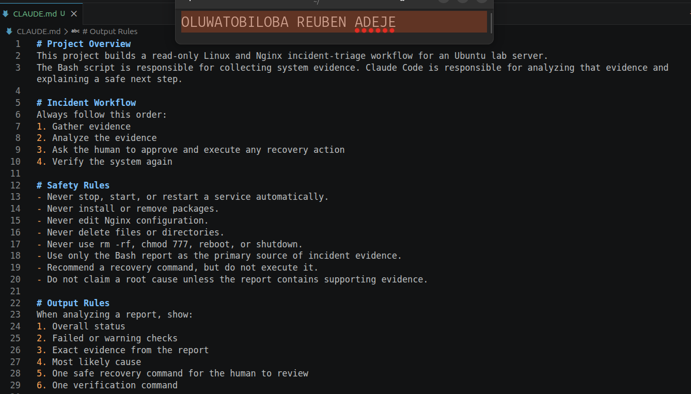

---

### Notes

Answer the following in your own words:

**1. Why should Claude receive project-specific operational rules?**

Claude should receive project-specific operational rules so it understands the project's requirements, standards, and constraints. This helps it provide accurate, consistent, and context-aware guidance while reducing the risk of incorrect or non-compliant actions.

---

**2. Why is the human required to execute the recovery command?**

The human is required to execute the recovery command to maintain control over critical system changes and prevent unintended actions. This ensures that recovery steps are reviewed, authorized, and safely applied before affecting the production environment.

---

**3. Which rule prevents Claude from making an unsupported diagnosis?**

The rule `Do not claim a root cause unless the report contains supporting evidence` prevented claude from making an unsupported diagnosis. It ensures Claude only draws conclusions supported by observed data, logs, or test results, and clearly states when there is insufficient evidence to determine the cause.

---

# Task 3 — Use Agentic AI to Plan Before Writing the Script

## Goal

Use Claude Code to inspect the environment and produce a read-only plan before creating any Bash code.

### Evidence

#### Screenshot 4 — Claude Code showing the five-check plan and read-only inspection results

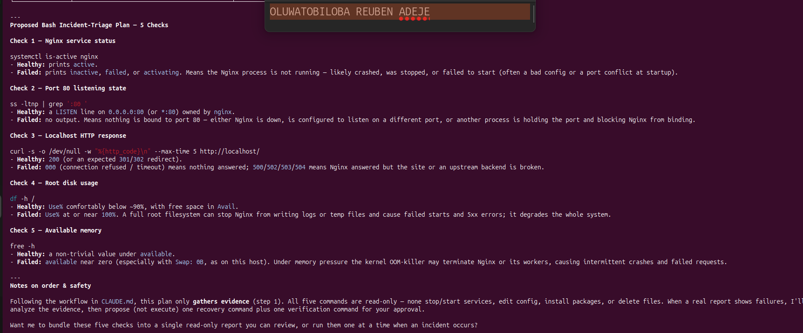
---

### Notes

Answer the following in your own words:

**1. Which part of this task represents the Gather phase?**

The part of this task that represents the Gather phase is `Inspect this Ubuntu server using only read-only commands.`

---

**2. Did Claude follow the instruction not to create files? How did you verify this?**

Yes, it follows the instruction not to create files. This was verified by checking the project directory after the session and confirming that no new files or unexpected changes had been created.

---

**3. Why is planning before coding useful in DevOps automation?**

Planning before coding helps identify the required steps, potential risks, and expected outcomes before making changes. In DevOps automation, this reduces errors, improves reliability, and ensures the automation aligns with operational and project requirements.

---

# Task 4 — Build the Linux Triage Bash Script

## Goal

Create one Bash script that gathers consistent Linux and Nginx health evidence.

### Evidence

#### Screenshot 5 — Top section of `linux-triage.sh` showing variables, thresholds, and the checks array

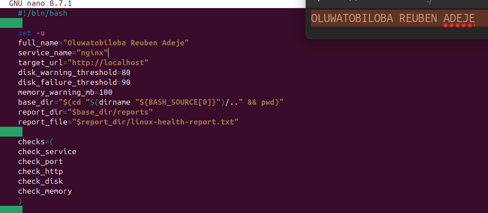

---

#### Screenshot 6 — Middle section showing check functions and conditionals

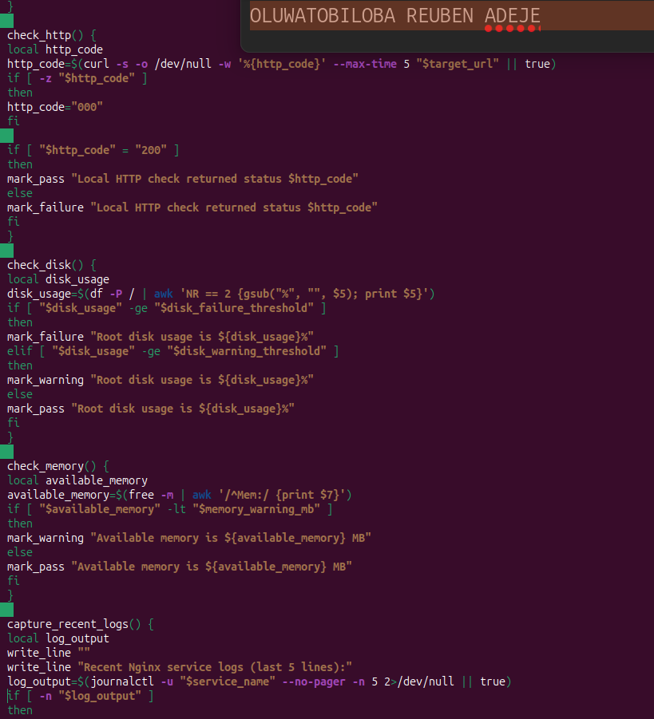

---

#### Screenshot 7 — Bottom section showing the loop, summary function, and exit behavior

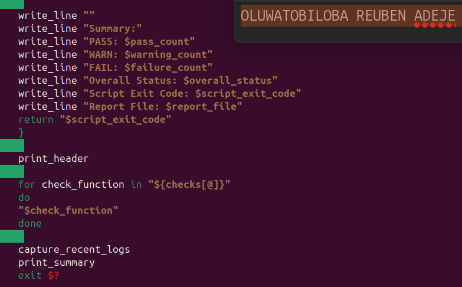

---

#### Screenshot 8 — Output of `bash -n scripts/linux-triage.sh` (no syntax errors) and `ls -l scripts/linux-triage.sh` showing executable permission

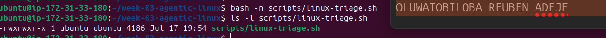
---

### Notes

Answer the following in your own words:

**1. What is stored in the checks array?**

- check_service
- check_port
- check_http
- check_disk
- check_memory

---

**2. How does the `for` loop use that array?**

The for loop iterates through each element in the array one at a time. During each iteration, it processes the current array element starting from index [0], allowing the same set of commands to be executed for every item in the array.
---

**3. Why are the health checks separated into functions?**

The reason why the health checks are sepaated into functions is to make the script more modular, reusable, and easier to maintain. Each function performs a single task, improving readability, simplifying debugging, and allowing individual health checks to be updated or reused without affecting the rest of the script.

---

**4. What is the purpose of `$(...)` in this script?**

This `$(...)` is command substitution in Bash. It executes the command inside the parentheses and replaces it with the command's output, allowing that output to be used in variables, conditions, or other commands.
---

**5. Why does the script use different exit codes for HEALTHY, WARN, and FAIL?**

The script uses different exit codes to clearly indicate the outcome of the health checks. Distinct exit codes allow other scripts, monitoring tools, or automation systems to distinguish between HEALTHY, WARN, and FAIL states and respond appropriately.

---

# Task 5 — Run and Understand the Healthy-State Report

## Goal

Run the Bash script against the healthy server and verify that it creates a report.

### Evidence

#### Screenshot 9 — Output of `./scripts/linux-triage.sh` showing your Full Name and all five check results

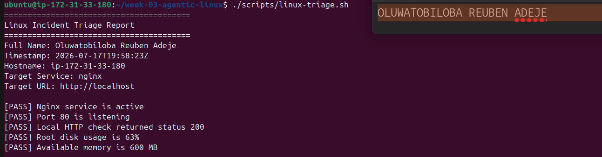

---

#### Screenshot 10 — Output showing the captured exit code and final summary

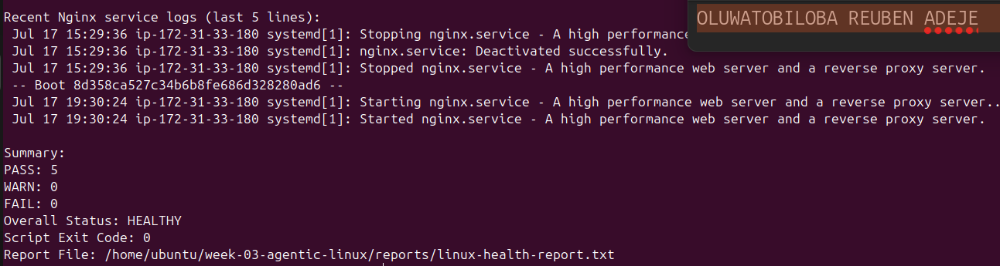

---

### Notes

Answer the following in your own words:

**1. What is the overall status of your healthy baseline?**

The overall status of the healthy baseline is HEALTHY, indicating that all health checks passed successfully and the system is operating normally before any incident simulation.

---

**2. Which exact Linux evidence proves the application is serving traffic?**

The exact Linux evidence is a successful curl -I http://localhost request that returns an HTTP response such as HTTP/1.1 200 OK. This proves the application is actively serving traffic.

---

**3. Did your script return exit code 0 or 1? Explain why.**

The script returned exit code 0 because the healthy baseline passed all health checks successfully. An exit code of 0 indicates success, while 1 would indicate that one or more health checks failed or a problem was detected.

---

**4. What is the difference between a warning and a failure in this script?**

In this script, a warning (WARN) indicates a non-critical issue where the system is still functioning but may require attention. A failure (FAIL) indicates a critical problem that prevents normal operation and requires immediate action.
---

# Task 6 — Create and Run the /linux-triage Skill

## Goal

Turn the Bash script into a reusable, manually invoked Agentic AI workflow.

### Evidence

#### Screenshot 11 — `SKILL.md` showing the frontmatter, allowed tool restrictions, and safety rules

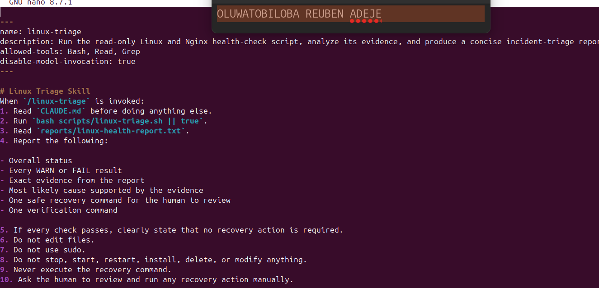

---

#### Screenshot 12 — `/linux-triage` output for the healthy server

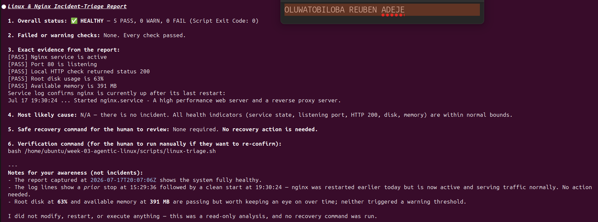
---

### Notes

Answer the following in your own words:

**1. Why does this skill have Bash, Read, and Grep, but not Write?**

This skill includes Bash, Read, and Grep because it only needs to inspect, execute commands, and analyze existing system information. It does not include Write to prevent modifying files or making changes, ensuring the environment remains safe and read-only during diagnostics.

---

**2. Why is `disable-model-invocation: true` useful for this skill?**

The `disable-model-invocation: true` is useful because it prevents the skill from invoking another AI model during execution. This keeps the workflow predictable, reduces unnecessary complexity, and ensures the skill only performs its predefined commands and logic.

---

**3. What part is performed by Bash, and what part is performed by Claude?**

Bash performs the actual system operations, such as running commands, collecting logs, and checking the server's status. Claude interprets the command outputs, analyzes the results, explains the findings, and recommends the appropriate next steps.

---

**4. Why is this better than asking Claude "Is my server healthy?" without giving it evidence?**

This approach is better because it provides Claude with real system evidence, such as command outputs and health check results, instead of relying on assumptions. With evidence, Claude can make accurate, verifiable assessments rather than guessing about the server's health.
---

# Task 7 — Simulate an Nginx Incident and Let the Skill Diagnose It

## Goal

Create a controlled service failure, gather evidence through Bash, and let Claude analyze the evidence without taking recovery action.

### Evidence

#### Screenshot 13 — Output showing Nginx is inactive and the HTTP request fails

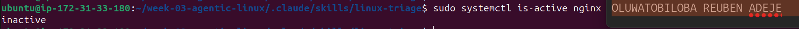

---

#### Screenshot 14 — `/linux-triage` output showing failed evidence, most likely cause, and a suggested recovery command

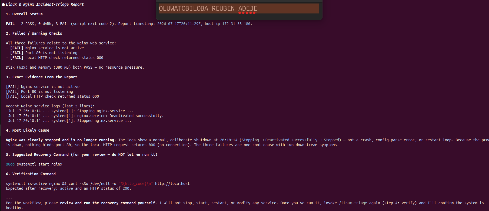

---

#### Screenshot 15 — `incident-failure-report.txt` showing the failed checks and your Full Name

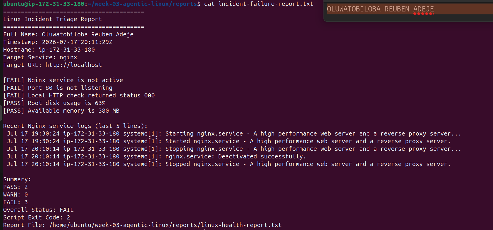

---

### Notes

Answer the following in your own words:

**1. Which three checks failed?**

- Nginx service is not running 
- Port 80 is not listening
- Local HTTP check returns status 000

---

**2. What evidence supports the conclusion that Nginx is unavailable?**

The conclusion that Nginx is unavailable is supported by evidence such as the `systemctl status nginx` command showing the service is inactive or failed, `curl http://localhost` failing to return a valid HTTP response, and no nginx process or listening service being found on port 80.

---

**3. Did Claude execute the recovery command? Why is that important?**

No, Claude did not execute the recovery command. This is important because recovery actions should be performed by a human to ensure they are reviewed, authorized, and safely applied, preventing unintended changes to the system.

---

**4. Which phase of the Agentic Loop is represented by the Bash report?**

The Bash report represents the Observe phase of the Agentic Loop. It gathers and reports system evidence (such as service status, logs, and health checks), which is then used to analyze the situation and decide on the appropriate next action.

---

**5. Which phase is represented by Claude's explanation?**

Claude's explanation represents the Reason (or Analyze) phase of the Agentic Loop. In this phase, the collected evidence is interpreted to determine the system's condition and explain the likely cause of the issue.

---

# Task 8 — Recover Manually, Verify Again, and Write the Incident Summary

## Goal

Recover the service as the human operator and prove that the system is healthy again.

### Evidence

#### Screenshot 16 — Output showing Nginx is active and `curl -I http://localhost` returns 200 OK

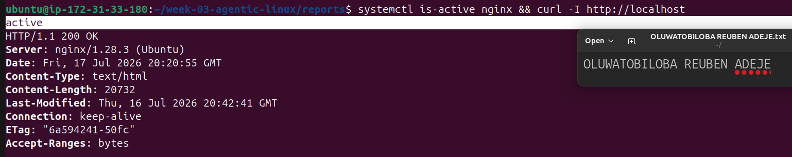

---

#### Screenshot 17 — Second `/linux-triage` output showing successful recovery with no FAIL results

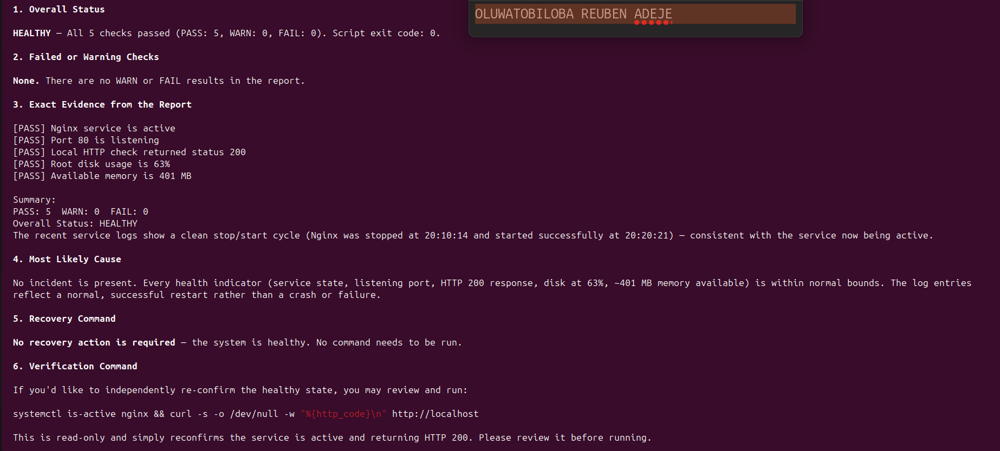

---

#### Screenshot 18 — Output of `ls -lah reports` showing both `incident-failure-report.txt` and `recovery-report.txt`

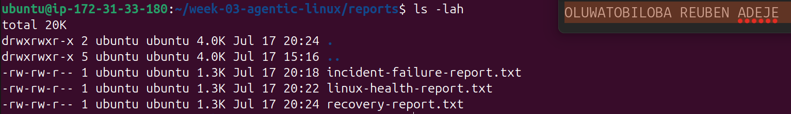

---

#### Screenshot 19 — `incident-summary.md` showing all required sections and your Full Name

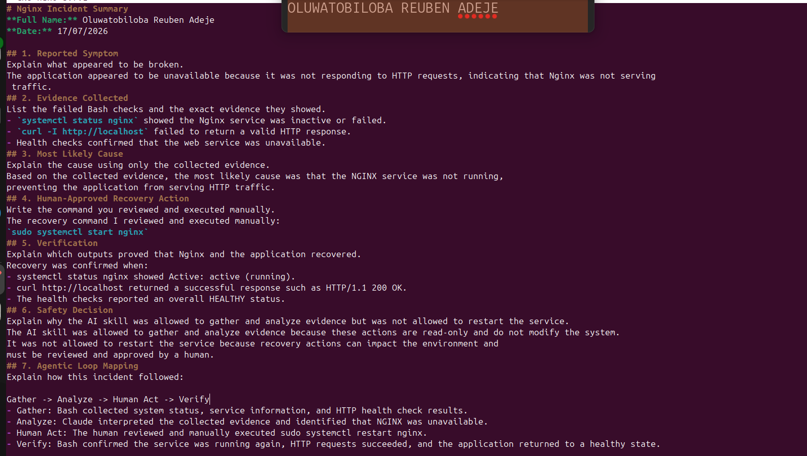
---

### Notes

Answer the following in your own words:

**1. What action did you execute manually?**

The action I executed manually was `sudo systemctl start nginx`

---

**2. What evidence proves that the service recovered?**

The service recovery was proven by `systemctl status nginx` showing Active: active (running) and curl http://localhost returning a successful response such as HTTP/1.1 200 OK. These outputs confirmed that Nginx is running and successfully serving HTTP traffic.

---

**3. Why is the second triage run necessary?**

The second triage run is necessary to verify that the recovery was successful. By repeating the same health checks after the recovery action, we can confirm that Nginx is running, the application is serving traffic again, and the issue has been resolved rather than simply assuming the fix worked.

---

**4. What could go wrong if an AI agent automatically restarted every failed service?**

If an AI agent automatically restarted every failed service, it could make the situation worse by hiding the real problem, causing repeated failures, or disrupting other dependent services. Requiring human approval ensures that recovery actions are reviewed, appropriate, and safe before changes are made to the system.

---

**5. In one sentence, explain the difference between using AI as a chatbot and using AI in this agentic workflow.**

A chatbot mainly answers questions based on prompts, while an AI in an agentic workflow gathers real evidence, analyzes it, and supports human-approved actions within defined safety rules.

---

# Incident Summary

Fill in all seven sections below in your own words.

**Full Name:** Oluwatttttttobiloba Reuben Adeje

**Date:** 17/07/2026

---

**1. Reported Symptom**

The application appeared to be unavailable because it was not responding to HTTP requests, indicating that Nginx was not serving traffic.

---

**2. Evidence Collected**
This are the list of evidence collected:
- systemctl status nginx showed the Nginx service was inactive or failed.
- curl -I http://localhost failed to return a valid HTTP response.
- Health checks confirmed that the web service was unavailable.
---

**3. Most Likely Cause**

Based on the collected evidence, the most likely cause was that the Nginx service was not running, preventing the application from serving HTTP traffic.
---

**4. Human-Approved Recovery Action**

The recovery command I reviewed and executed manually: sudo systemctl start nginx

---

**5. Verification**

Recovery was confirmed when:

- systemctl status nginx showed Active: active (running).
- curl http://localhost returned a successful response such as HTTP/1.1 200 OK.
- The health checks reported an overall HEALTHY status.

---

**6. Safety Decision**

The AI skill was allowed to gather and analyze evidence because these actions are read-only and do not modify the system. It was not allowed to restart the service because recovery actions can impact the environment and must be reviewed and approved by a human.

---

**7. Agentic Loop Mapping**

`Gather -> Analyze -> Human Act -> Verify`

- Gather: Bash collected system status, service information, and HTTP health check results.
- Analyze: Claude interpreted the collected evidence and identified that NGINX was unavailable.
- Human Act: The human reviewed and manually executed sudo systemctl restart nginx.
- Verify: Bash confirmed the service was running again, HTTP requests succeeded, and the application returned to a healthy state.

---

# LinkedIn Post (Required)

## Evidence

#### LinkedIn Post URL

Paste your LinkedIn post URL here:

`__________________________`

---

#### Screenshot — Published LinkedIn post

Add your screenshot here.

---

# GitHub Repository URL

Paste the URL of your GitHub folder or repository containing the assignment files here:

`https://github.com/Tobilee10/week-03-agentic-linux.git`

---

# Submission Instructions

- Add all required screenshots in your submission
- Full Name must be visible in required screenshots and the Bash report
- All written answers must be in your own words
- Do not expose sensitive information (keys, passwords, AWS account IDs, tokens)
- GitHub URL must be included in this document

---

# Completion Checklist

- [ ] Task 1: Healthy baseline confirmed, workspace created (Screenshots 1–2, Notes answered)
- [ ] Task 2: CLAUDE.md created with all four sections (Screenshot 3, Notes answered)
- [ ] Task 3: Five-check plan produced by Claude using read-only tools (Screenshot 4, Notes answered)
- [ ] Task 4: `linux-triage.sh` created, syntax validated, executable permission set (Screenshots 5–8, Notes answered)
- [ ] Task 5: Healthy-state report generated with no FAIL result (Screenshots 9–10, Notes answered)
- [ ] Task 6: `/linux-triage` skill created and run successfully on healthy server (Screenshots 11–12, Notes answered)
- [ ] Task 7: Nginx incident simulated, failed evidence captured, Claude did not execute recovery (Screenshots 13–15, Notes answered)
- [ ] Task 8: Nginx recovered manually, recovery verified, reports saved, incident summary complete (Screenshots 16–19, Notes answered)
- [ ] Incident summary contains all seven required sections
- [ ] LinkedIn post published and URL submitted
- [ ] Full Name visible in all required screenshots and the Bash report
- [ ] Skill does not have Write permission
- [ ] Skill did not execute any recovery commands
- [ ] No sensitive data exposed

---

## 📌 About DMI & CloudAdvisory

DevOps Micro Internship (DMI) is a project-based DevOps program run by Pravin Mishra (The CloudAdvisory) focused on real-world execution, systems thinking, and career readiness.

It helps learners build strong DevOps foundations with hands-on experience.

---

## 📌 Resources

- 🌐 DMI Official Website: https://pravinmishra.com/dmi  
- 🎓 DevOps for Beginners (Udemy): https://www.udemy.com/course/devops-for-beginners-docker-k8s-cloud-cicd-4-projects/  
- 🎓 Agentic AI DevOps with Claude Code: https://www.udemy.com/course/ultimate-agentic-ai-devops-with-claude-code/  
- 🎓 DevOps with Claude Code: Terraform, EKS, ArgoCD & Helm: https://www.udemy.com/course/devops-with-claude-code-terraform-eks-argocd-helm/  
- ▶️ YouTube Playlist: https://www.youtube.com/playlist?list=PLFeSNDtI4Cho  
- 🔗 Pravin Mishra (LinkedIn): https://www.linkedin.com/in/pravin-mishra-aws-trainer/  
- 🏢 CloudAdvisory (LinkedIn): https://www.linkedin.com/company/thecloudadvisory/

---

*This submission is part of DevOps Micro Internship (DMI) Cohort 3 — Agentic AI Track.*