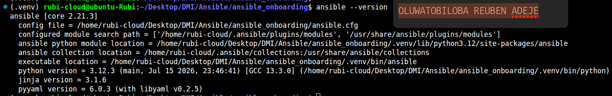
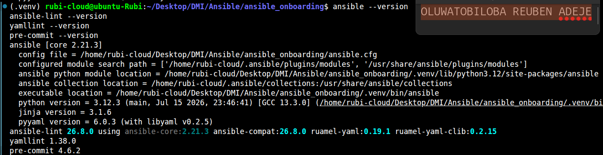
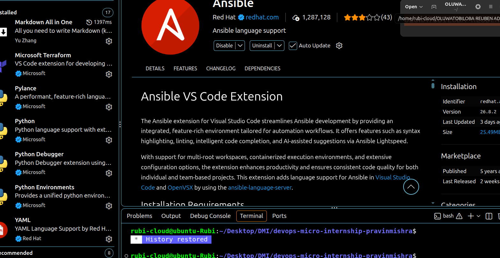
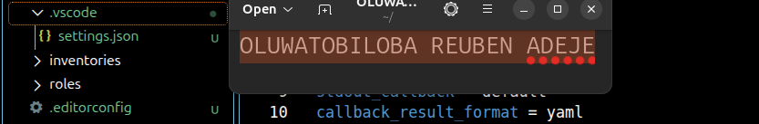
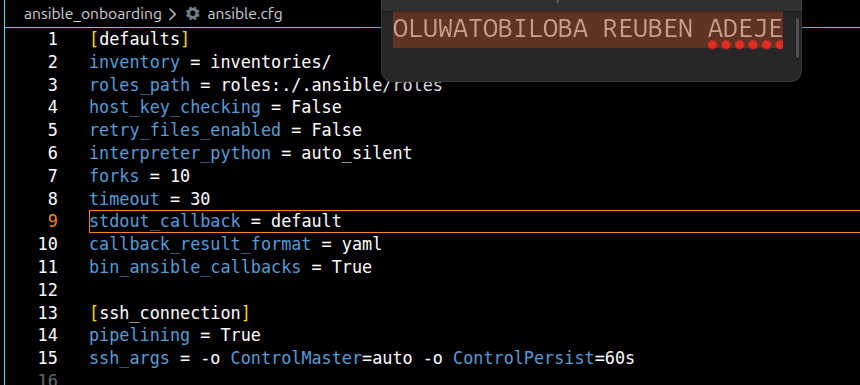
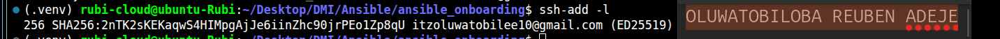
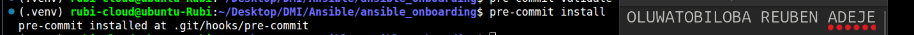
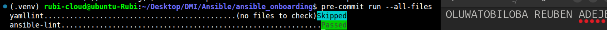
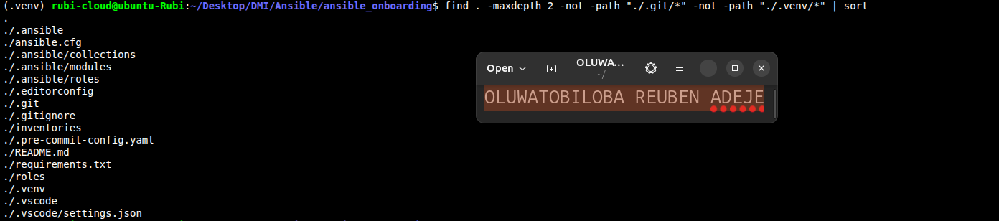
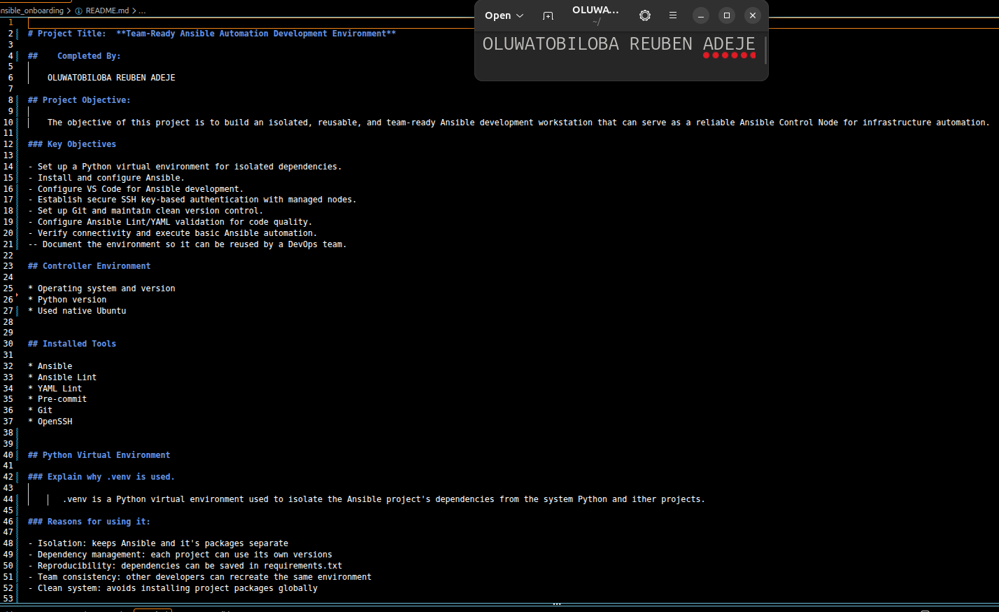

# Assignment 1 — Onboarding: Workstation Setup, Standards & AI (Go Beyond)

Part of the DevOps Micro Internship (DMI) Cohort 3 with Agentic AI

---

## Purpose

In this assignment, you will set up a production-ready Ansible development workstation following real-world team standards: an isolated Python environment, VS Code tooling, SSH readiness, Git hygiene, pre-commit hooks, and reproducible onboarding documentation.

---

# Task 1 — Environment & Ansible Install

## Goal

Create and activate an isolated `.venv` inside `ansible-onboarding/`, install `ansible`, `ansible-lint`, and `yamllint`, and save dependencies to `requirements.txt`.

### Evidence

#### Screenshot 1 — Terminal showing the activated `.venv` and successful `ansible --version` output

---

#### Screenshot 2 — Terminal showing successful `ansible-lint --version` output and `requirements.txt`

---

# Task 2 — VS Code Setup (Tooling That Teams Expect)

## Goal

Install the Ansible, YAML, and Python VS Code extensions, and create `.vscode/settings.json` and `.editorconfig` with the team-standard settings.

### Evidence

#### Screenshot 3 — VS Code Extensions panel showing Ansible, YAML, and Python installed

---

#### Screenshot 4 — VS Code showing `.vscode/settings.json` and `.editorconfig`

---

# Task 3 — Baseline ansible.cfg (Team-Friendly Defaults)

## Goal

Create `ansible.cfg` in the project root with the team-friendly defaults and SSH connection settings, and confirm Ansible reads it.

### Evidence

#### Screenshot 5 — VS Code or terminal showing `ansible.cfg` in the project root with the supplied settings

---

# Task 4 — SSH Readiness (Enterprise Basics)

## Goal

Generate or use an Ed25519 SSH key, load it into `ssh-agent`, and configure `~/.ssh/config` with safe defaults.

### Evidence

#### Screenshot 6 — Terminal showing `ssh-add -l` with the key loaded (do not expose private-key contents)

---

# Task 5 — Git Identity, Signing & Hooks

## Goal

Configure Git identity and the `main` default branch, install `pre-commit`, add `.pre-commit-config.yaml` with `yamllint` and `ansible-lint` hooks, and run the hooks as a smoke test.

### Evidence

#### Screenshot 7 — Terminal showing `pre-commit install` output

---

#### Screenshot 8 — Terminal showing `pre-commit run --all-files` passing

---

# Task 6 — README + Checklist

## Goal

Document the workstation setup in `README.md`, including a "New Machine? Do This" checklist with 10–12 bullet points.

### Evidence

#### Screenshot 9 — Repository tree showing the required files

---

#### Screenshot 10 — `README.md` showing machine details and the "New Machine? Do This" checklist

---

### Notes

State one thing that makes this setup team-friendly, and one pitfall you avoided (e.g. global pip, missing SSH agent). Note any corporate proxy or CA certificate steps, if applicable.

#### Team-Friendly Feature

Automated Pre-commit Code Quality Hooks: Implementing pre-commit hooks configured with ansible-lint and YAML validation ensures every engineer automatically checks their code locally before committing to Git. This enforces identical coding standards, syntax correctness, and Ansible best practices across the entire engineering team, preventing broken or malformed automation playbooks from reaching the shared repository.

#### Pitfall Avoided

    Accidental Exposure of Sensitive SSH Private Keys: Adding credential and machine-specific file patterns (*.pem, id_rsa, id_ed25519, .venv/, .env) directly to the project's .gitignore file prevented sensitive SSH keys from being tracked or pushed to Git. Committing private keys exposes host access to unauthorized parties; using proper ignore rules alongside the local SSH agent ensures secure, key-based authentication without risking credential leaks.

---

# Submission Instructions

- Add all required screenshots in your submission
- Do not commit the `.venv` directory, SSH private keys, passwords, tokens, or other secrets

---

# Completion Checklist

- [x] Task 1: Isolated environment created, Ansible and lint tools installed (Screenshots 1–2)
- [x] Task 2: VS Code extensions and workspace settings configured (Screenshots 3–4)
- [x] Task 3: `ansible.cfg` created with team defaults (Screenshot 5)
- [x] Task 4: SSH key generated and loaded into agent (Screenshot 6)
- [x] Task 5: Git identity configured and pre-commit hooks passing (Screenshots 7–8)
- [x] Task 6: README and checklist completed (Screenshots 9–10)
- [x] Team-friendly choice / pitfall notes written (Notes)
- [x] No private keys or secrets exposed

---

## 📌 About DMI & CloudAdvisory

DevOps Micro Internship (DMI) is a project-based DevOps program run by Pravin Mishra (The CloudAdvisory) focused on real-world execution, systems thinking, and career readiness.

It helps learners build strong DevOps foundations with hands-on experience.

---

## 📌 Resources

- 🌐 DMI Official Website: https://dmi.pravinmishra.com?utm_source=github&utm_medium=readme  
- 🎓 University: https://university.pravinmishra.com?utm_source=github&utm_medium=readme  
- 💬 Discord Community: https://discord.pravinmishra.com?utm_source=github&utm_medium=readme  
- 📝 Blog: https://dmi.pravinmishra.com/blog?utm_source=github&utm_medium=readme  
- ▶️ YouTube Playlist: https://www.youtube.com/playlist?list=PLFeSNDtI4Cho  
- 🔗 Pravin Mishra (LinkedIn): https://www.linkedin.com/in/pravin-mishra-aws-trainer/  
- 🏢 CloudAdvisory (LinkedIn): https://www.linkedin.com/company/thecloudadvisory/

---

*This submission is part of DevOps Micro Internship (DMI) Cohort 3 — Agentic AI Track.*
