# Assignment 03 — Deploy a Static Website to Multiple Servers Using a Multi-Play Ansible Playbook

Part of the DevOps Micro Internship (DMI) with Agentic AI

---

## Student Details

**Full Name:** Add your full name here  
**Cloud Platform Used:** AWS / Azure  
**Server 1 URL:** `http://<SERVER_1_PUBLIC_IP>`  
**Server 2 URL:** `http://<SERVER_2_PUBLIC_IP>`

---

## Purpose

In this assignment, you will create a multi-play Ansible playbook to install Nginx, deploy a static website to two Ubuntu servers, and verify that the website is accessible from both servers.

You may use either AWS EC2 instances or Azure Virtual Machines as your managed servers.

---

# Task 1 — Create the Project Structure

## Goal

Create the required folders and files for the Ansible project.

## Evidence

### Screenshot 1 — Terminal or VS Code showing the complete `static-web` project structure

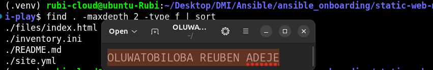

---

# Task 2 — Configure the Ansible Inventory

## Goal

Add both Ubuntu servers to the Ansible inventory.

## Evidence

### Screenshot 2 — Output of `ansible-inventory -i inventory.ini --graph` showing `web1` and `web2`

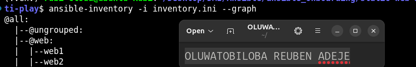

---

## Configuration File

Copy and paste the complete contents of your `inventory.ini` file below:

```ini
[web]
web1 ansible_host=18.191.150.206
web2 ansible_host=3.22.216.3
 

[all:vars]
ansible_user=ubuntu
ansible_ssh_private_key_file=/home/rubi-cloud/.ssh/ansible
```

---

# Task 3 — Verify Ansible Connectivity

## Goal

Confirm that the Ansible controller can connect to both servers.

## Evidence

### Screenshot 3 — Ansible ping output showing `SUCCESS` and `pong` for both servers

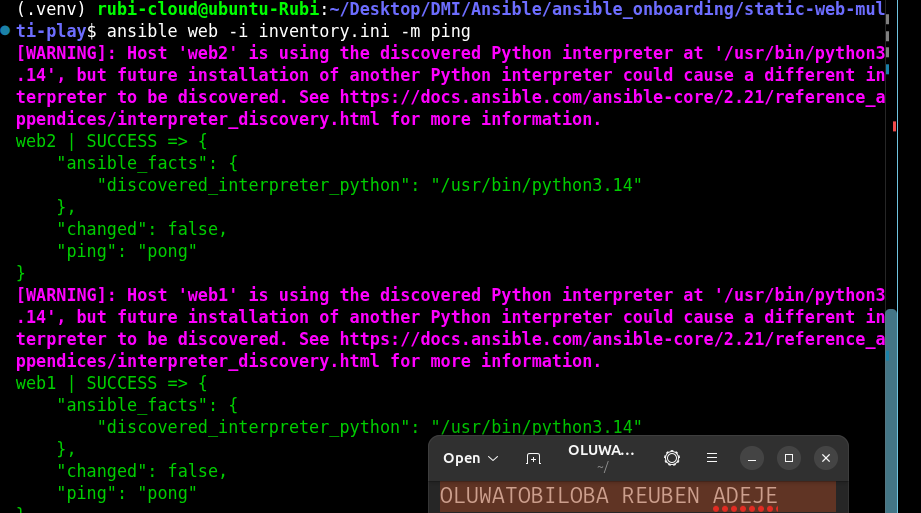

---

# Task 4 — Download and Personalize the Static Website

## Goal

Download `index.html` to the Ansible controller and personalize the website with your full name.

## Evidence

### Screenshot 4 — Edited `files/index.html` showing the footer line with your full name

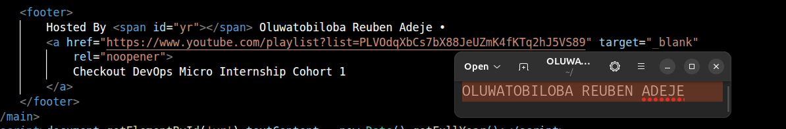

---

# Task 5 — Create the Multi-Play Ansible Playbook

## Goal

Create a single Ansible playbook containing separate plays for installation, deployment, and verification.

## Configuration File

Copy and paste the complete contents of your `site.yml` file below:

```yaml
---
- name: Install and Start Nginx Web Server
  hosts: web
  become: yes
  remote_user: ubuntu
  
  tasks:  
    - name: Install Nginx
      apt:
        name: nginx
        state: present
        update_cache: yes
    - name: Start and Enable Nginx
      service:
        name: nginx
        state: started
        enabled: yes

- name: Deploy Static Website
  hosts: web
  become: yes
  remote_user: ubuntu

  tasks:
    - name: Copy custom index.html
      ansible.builtin.copy:
        src: "files/index.html"
        dest: "/var/www/html/"
        owner: www-data
        group: www-data
        mode: "0755"        

- name: Configure Nginx to Serve the Site
  hosts: web
  become: yes
  remote_user: ubuntu

  tasks:
    - name: Overwrite default Nginx site configuration
      ansible.builtin.copy:
        dest: /etc/nginx/sites-available/default
        content: |
          server {
            listen 80;
            server_name _;
            root /var/www/html;
            index index.html;
            location / {
              try_files $uri /index.html;
            }
            error_page 404 /index.html;
          }
        owner: root
        group: root
        mode: "0644"

- name: Restart Nginx After Configuration
  hosts: web
  become: yes
  tasks:
    - name: Restart Nginx to apply changes
      service:
        name: nginx
        state: restarted

```

---

# Task 6 — Validate the Playbook Syntax

## Goal

Check the playbook for YAML or Ansible syntax errors before running it.

## Evidence

### Screenshot 5 — Successful syntax-check output showing `playbook: site.yml`

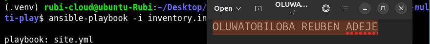

---

# Task 7 — Run the Multi-Play Playbook

## Goal

Install Nginx, deploy the website, and verify both servers in one playbook run.

## Evidence

### Screenshot 6 — Play 3 verification showing HTTP `200` for both servers

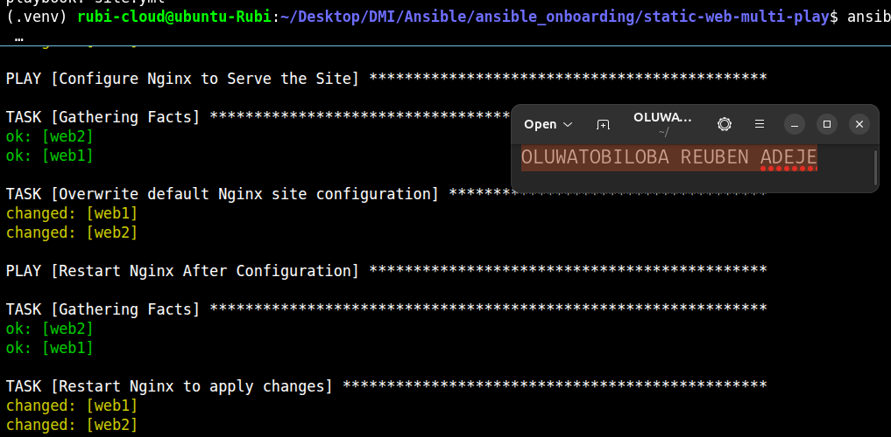

---

### Screenshot 7 — Final play recap showing `unreachable=0` and `failed=0` for `web1`, `web2`, and `localhost`

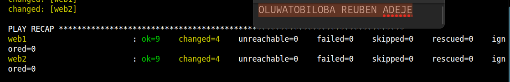

---

# Task 8 — Verify Idempotency

## Goal

Run the playbook again and confirm that it does not make unnecessary changes.

## Evidence

### Screenshot 8 — Second playbook run showing the play recap with `changed=0`, `unreachable=0`, and `failed=0` for both web servers

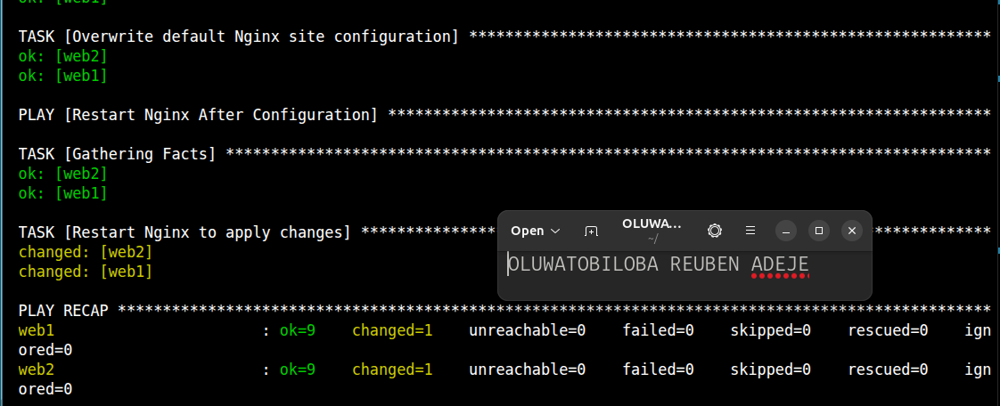

---

# Task 9 — Test Both Websites Manually

## Goal

Confirm that the static website is accessible from both public IP addresses.

## Evidence

### Screenshot 9 — `curl -I` output showing HTTP `200 OK` from both servers

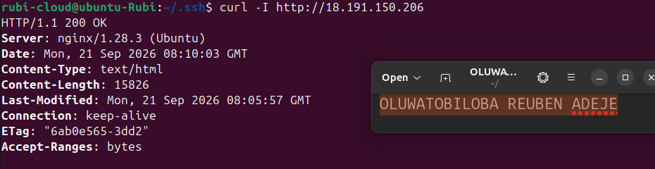

---

### Screenshot 10 — Browser showing the website from Server 1 with the public IP and your full name visible

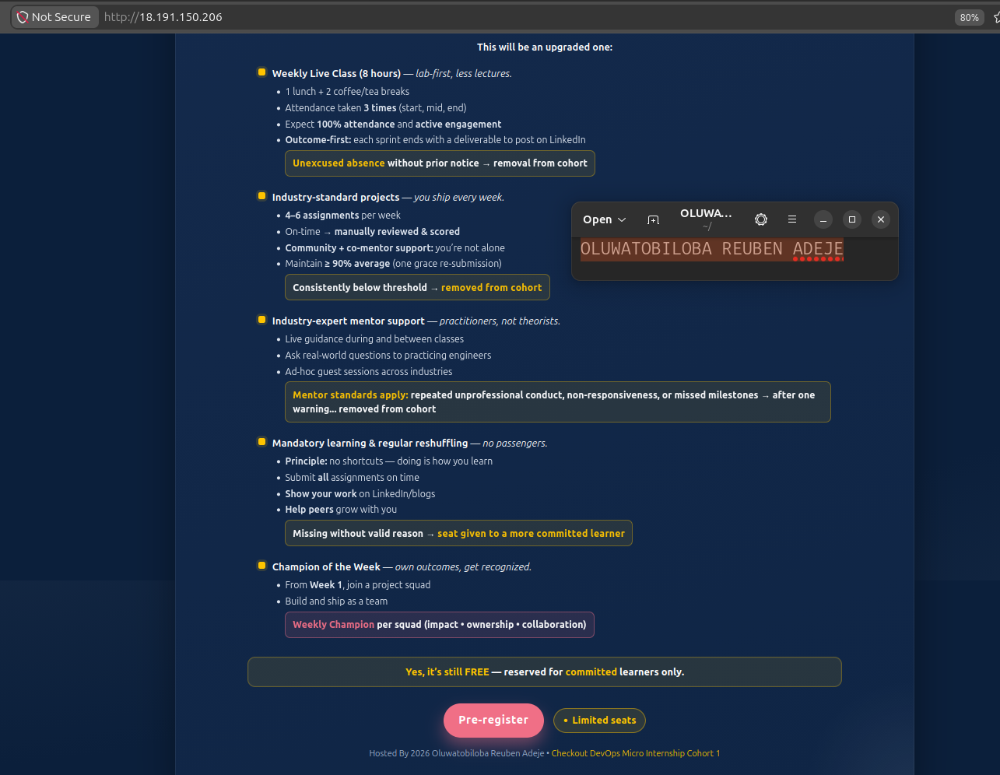

---

### Screenshot 11 — Browser showing the website from Server 2 with the public IP and your full name visible

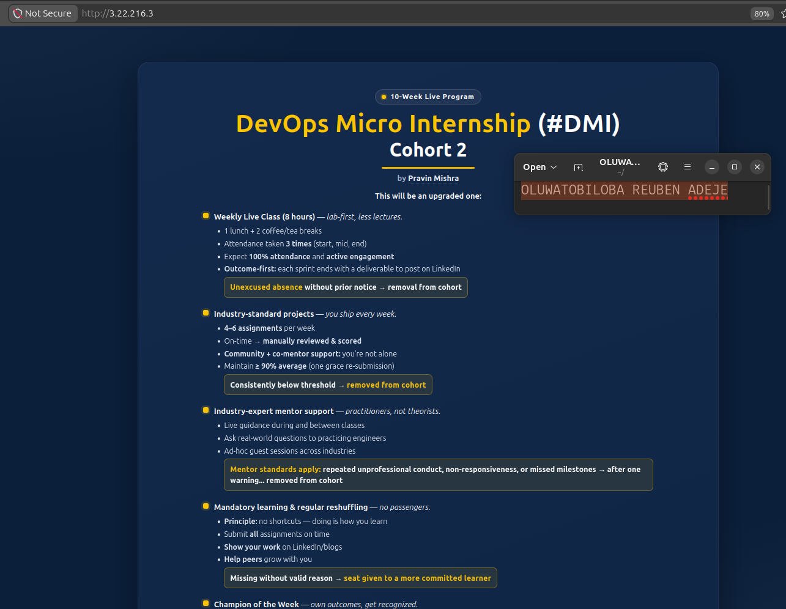

---

## Website URLs

Add both deployed website URLs below:

```text
Server 1: http://3.22.216.3/
Server 2: http://18.191.150.206/
```

---

# Task 10 — Complete the Project README

## Goal

Document how the project works and record what you learned.

## README Content

Copy and paste the complete contents of your `README.md` file below:

```markdown
# TITLE: **Multi-Play Ansible Static Website Deployment**
     
## Project Overview
     
This project demonstrates how to use **Ansible** to automate the deployment of a static website across multiple AWS EC2 servers.

Instead of manually connecting to each server through SSH and configuring the web server individually, Ansible is used to manage both servers from a single contol node.

   The playbook is divided into multiple plays:
- Install and Start Nginx on the managed  servers
- Deploy the static website content to the Nginx web directory
- Configure Nginx to Serve the Site from the web directory
- Restart Nginx After Configuration

This approach demonstrates configuration management, multi-server automation, and repeatable application deployment using Ansible


## Environment
     
- Cloud platform: AWS
- Operating system: Linux Ubuntu
- Number of managed servers: 2 AWS EC2 instances
- Web server: Nginx
- Connection: SSH
- Website Type: Static website


## Project Structure

static-web-multi-play/
│  
├── files
│   └── index.html
├── inventory.ini
├── README.md
└── site.yml

|Directory| Purpose
|----------|-------|
| inventory.ini | Defines the AWS EC2 serves managed by Ansible
| site.yml | Contains the Ansible plays and tasks
| files/   | Contains the static ebsite files
| README.md| Containsproject documentation  

## How to Run the Playbook
     
### Step1: First verify that Ansible can communicate with the servers.

    ansible all -i inventory.ini -m ping
    


### Step2: Validate the Playbook Syntax

    ansible-playbook -i inventory.ini site.yml --syntax-check
    

### Step3: Run the playbook

    ansible-playbook -i inventory.ini site.yml

Ansible will:
- Connect to both EC2 servers
- Install Nginx
- Deploy the website files
- Configure the servers according to the playbook
- Report the result of each task


### Step4: Verify Idempotency
    ansible-playbook -i inventory.ini site.yml

- Nginx should already be installed.
- Nginx should already be running and enabled.
- index.html should already contain the correct content
- The copy task should display ok.
- The Nginx reload handler should not run because the file did not change.
- Both website checks should still return HTTP 200.
- The managed servers should normally show changed=0.
- All hosts must show unreachable=0 and failed=0.

This demonstrates that the playbook is idempotent.


## Issue Faced and Solution
     
One challenge I faced was an **SSH connection error** when setting up Ansible.
The issue was caused by the AWS Security Group blocking public SSH access, and I had also not manually tested the SSH connection after creating the servers.
I resolved this by updating the Security Group inbound rules to allow SSH traffic on port `22` from my IP address.
I then manually tested the connection using `ssh` and verified the correct server IP, username, and SSH key.
After confirming SSH access, I updated the Ansible inventory with the correct connection details and used `ansible ping` to successfully verify connectivity.

     
## What I Learned
     
This project helped me understand seveal important Ansible concepts:
- [x] Multi-server automation: Ansible allows the same configuration tasks to be executed across multiple servers without manually connecting to each machine
- [x] Inventory management: I learned how to group managed servers in an inventory file and target the group from a playbook
- [x]  Multiple plays in a playbook: A playbook can contain multi plays, with each play responsible for a specific stage of the deployment
- [x]  Idempotent configuration: Ansible tasks are designed to be repeatable. Running the playbook multiple times shoult not unnecessarily reinstall or modify resources that are already in the desired state.
     
## Why Installation and Deployment Are Separate
     
    Installing nginx and deploying website content are separate concerns.

- The first play is responsible for preparing the server i.e Install and Start Nginx
- The second play is responsible for deploying the application content by copying the website files 
- The third play is responsible for configuring Nginx to serve the website from the web directory
- And the last play is responsible for restarting Nginx after configuration 
  
    Keeping these reponsibilities separate makes the playbook easier to understand, maintain, troubleshoot, and extend

    for example: if the website content changes, I can modify the deployment play without changing the Nginx installation logic

    This separation makes it easier to use the Nginx installation tasks for other projects.
     
## Benefit of the Ansible Copy Module
     
    The Ansible `copy` module allow website files to be transferred fom the Ansible control node directly to the managed servers.
    One major benefit is centralized and controlled deployment. Instead of cloning the website repository independently on every server, the control node can maintain the desired website version and distribute the required files to all managed serves.

```

---

# LinkedIn Post Required

## Evidence

### LinkedIn Post URL

Paste your LinkedIn post URL here:

`https://www.linkedin.com/posts/oluwatobiloba-adeje-2572b42a6_devops-aws-terraform-ugcPost-7507753552585547777-Zn2o/?utm_source=share&utm_medium=member_desktop&rcm=ACoAAEm6D2MBiHlTtqXxAdNL2_2Taiskof8w_Lw
---

### Screenshot — Published LinkedIn post

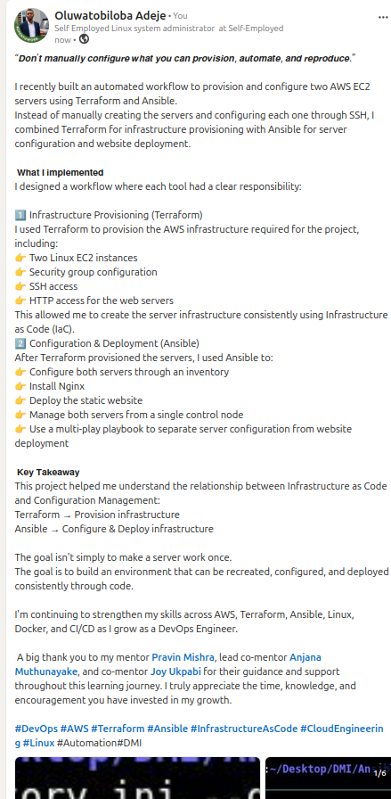

---

# Assignment Questions

Answer the following in your own words:

**1. What issue did you face while completing this assignment, and how did you fix it?**

One challenge I faced was an **SSH connection error** when setting up Ansible.
The issue was caused by the AWS Security Group blocking public SSH access, and I had also not manually tested the SSH connection after creating the servers.
I resolved this by updating the Security Group inbound rules to allow SSH traffic on port `22` from my IP address.
I then manually tested the connection using `ssh` and verified the correct server IP, username, and SSH key.
After confirming SSH access, I updated the Ansible inventory with the correct connection details and used `ansible ping` to successfully verify connectivity.

---

**2. What did you learn from this assignment?**

- [x] Multi-server automation: Ansible allows the same configuration tasks to be executed across multiple servers without manually connecting to each machine
- [x] Inventory management: I learned how to group managed servers in an inventory file and target the group from a playbook
- [x]  Multiple plays in a playbook: A playbook can contain multi plays, with each play responsible for a specific stage of the deployment
- [x]  Idempotent configuration: Ansible tasks are designed to be repeatable. Running the playbook multiple times shoult not unnecessarily reinstall or modify resources that are already in the desired state.

---

**3. Why is it useful to split installation, deployment, and verification into separate plays?**

- The first play is responsible for preparing the server i.e Install and Start Nginx
- The second play is responsible for deploying the application content by copying the website files 
- The third play is responsible for configuring Nginx to serve the website from the web directory
- And the last play is responsible for restarting Nginx after configuration 
  
    Keeping these reponsibilities separate makes the playbook easier to understand, maintain, troubleshoot, and extend

    for example: if the website content changes, I can modify the deployment play without changing the Nginx installation logic

    This separation makes it easier to use the Nginx installation tasks for other projects.

---

**4. What is one benefit of using the Ansible `copy` module instead of cloning the website directly from Git on every managed server?**

The Ansible `copy` module allow website files to be transferred fom the Ansible control node directly to the managed servers.
    One major benefit is centralized and controlled deployment. Instead of cloning the website repository independently on every server, the control node can maintain the desired website version and distribute the required files to all managed serves.

---

**5. What does idempotency mean in this assignment?**

Idempotency means that running the same Ansible task multiple times produces the same final result.
For example, installing a package that is already installed will not reinstall it unnecessarily.
Ansible checks the current state before making changes.
This makes automation safe, predictable, and repeatable.

---

**6. What does the Ansible `uri` module verify in Play 3?**

The Ansible uri module verifies that a web service is reachable and responding correctly.
In Play 3, it checks the application’s HTTP endpoint and confirms that it returns the expected status code.
This helps verify that the deployed application is running successfully.
It acts as a simple automated health check for the web service.
---

# Required Files

Confirm that the following files are included in your assignment folder:

- [x] `inventory.ini`
- [x] `site.yml`
- [x] `files/index.html`
- [x] `README.md`

---

# Submission Instructions

- Add all required screenshots in the correct order.
- Full Name must be visible in required screenshots.
- Include both deployed website URLs.
- Paste `inventory.ini`, `site.yml`, and `README.md` as editable text.
- Answer all assignment questions clearly in your own words.
- Add your LinkedIn post URL.
- Do not expose SSH private keys, passwords, cloud account IDs, or other sensitive information.

---

# Completion Checklist

- [x] Task 1: `static-web` folder structure is complete
- [x] Task 2: Both servers are listed under the `[web]` group in `inventory.ini`
- [x] Task 2: Inventory graph shows `web1` and `web2`
- [x] Task 3: Ansible ping returns `SUCCESS` and `pong` for both servers
- [x] Task 4: `files/index.html` contains your full name
- [x] Task 5: `site.yml` contains three separate plays
- [x] Task 5: Play 1 installs, starts, and enables Nginx
- [x] Task 5: Play 2 deploys `index.html` using the `copy` module
- [x] Task 5: Nginx reload handler is included
- [x] Task 5: Play 3 verifies both web servers from the controller
- [x] Task 6: Playbook syntax check passes
- [x] Task 7: First playbook run completes with `unreachable=0` and `failed=0`
- [x] Task 7: URI verification returns HTTP `200` for both servers
- [x] Task 8: Second playbook run demonstrates idempotency
- [x] Task 8: Second run shows `changed=0` for both web servers
- [x] Task 9: Both `curl -I` commands return HTTP `200 OK`
- [x] Task 9: Website loads from Server 1
- [x] Task 9: Website loads from Server 2
- [x] Task 9: Full name is visible on both deployed websites
- [x] Task 10: `README.md` contains all required explanations
- [x] Screenshots 1–11 are included
- [x] `inventory.ini`, `site.yml`, and `README.md` are pasted as editable text
- [x] Both website URLs are included
- [x] Assignment questions are answered
- [x] LinkedIn post published
- [x] LinkedIn post URL added
- [x] No sensitive information is exposed

---

## About DMI & CloudAdvisory

DevOps Micro Internship (DMI) is a project-based DevOps program run by Pravin Mishra and The CloudAdvisory, focused on real-world execution, systems thinking, and career readiness.

It helps learners build strong DevOps foundations with hands-on experience.

---

## Resources

- DMI Official Website: [https://dmi.pravinmishra.com?utm_source=github&utm_medium=readme](https://dmi.pravinmishra.com?utm_source=github&utm_medium=readme)
- University: [https://university.pravinmishra.com?utm_source=github&utm_medium=readme](https://university.pravinmishra.com?utm_source=github&utm_medium=readme)
- Discord Community: [https://discord.pravinmishra.com?utm_source=github&utm_medium=readme](https://discord.pravinmishra.com?utm_source=github&utm_medium=readme)
- Blog: [https://dmi.pravinmishra.com/blog?utm_source=github&utm_medium=readme](https://dmi.pravinmishra.com/blog?utm_source=github&utm_medium=readme)
- YouTube Playlist: [https://www.youtube.com/playlist?list=PLFeSNDtI4Cho](https://www.youtube.com/playlist?list=PLFeSNDtI4Cho)
- Pravin Mishra LinkedIn: [https://www.linkedin.com/in/pravin-mishra-aws-trainer/](https://www.linkedin.com/in/pravin-mishra-aws-trainer/)
- CloudAdvisory LinkedIn: [https://www.linkedin.com/company/thecloudadvisory/](https://www.linkedin.com/company/thecloudadvisory/)

---

*This submission is part of DevOps Micro Internship (DMI) — Agentic AI Track.*