# Assignment 04 — Deploy Mini Finance on Azure Using Terraform and Ansible

Part of the DevOps Micro Internship (DMI) with Agentic AI

---

## Purpose

In this assignment, you will provision Azure infrastructure using Terraform and deploy the Mini Finance website using an Ansible multi-play playbook.

Terraform will create the Azure Virtual Machine and networking resources. Ansible will install Nginx, clone the Mini Finance repository, deploy the website, and verify the deployment.

---

# Task 1 — Create the Project Structure

## Goal

Create separate directories and files for the Terraform infrastructure and Ansible configuration.

### Evidence

#### Screenshot 1 — Terminal or VS Code showing the complete `mini-finance` project structure

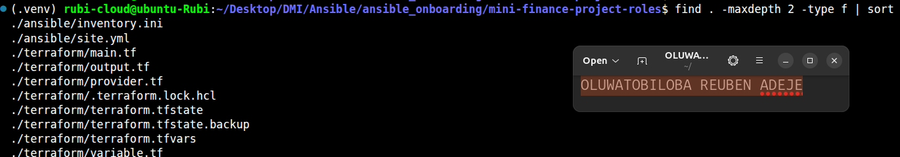

---

### Notes

Add your task notes here.

---

# Task 2 — Create the Azure Infrastructure Using Terraform

## Goal

Use Terraform to provision an Ubuntu Virtual Machine with the required Azure networking and security resources.

### Evidence

#### Screenshot 2 — Terraform code showing the `Allow-SSH` rule for port `22` and the `Allow-HTTP` rule for port `80`

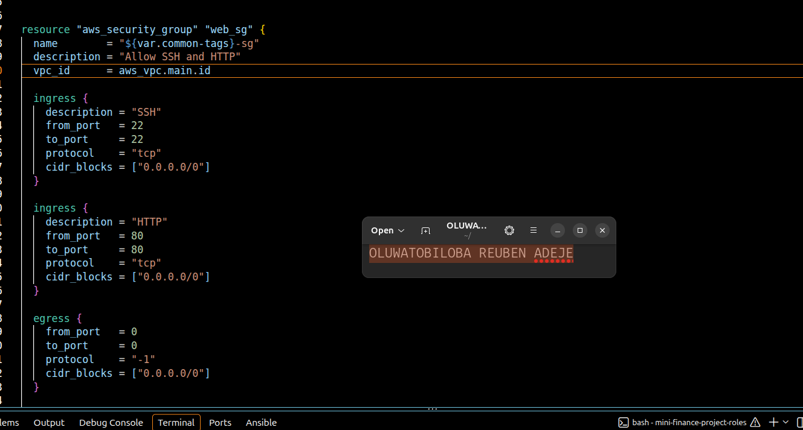

---

#### Screenshot 3 — Terraform code showing the association between `nsg-mini-finance` and `nic-mini-finance`

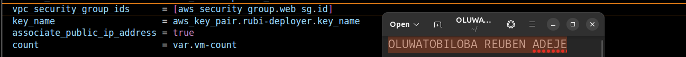

---

### Notes

Add your task notes here.

---

# Task 3 — Initialize and Apply the Terraform Configuration

## Goal

Format and validate the Terraform configuration, review the execution plan, and provision the Azure infrastructure.

### Evidence

#### Screenshot 4 — End of the `terraform apply` output showing `Apply complete!` with no errors

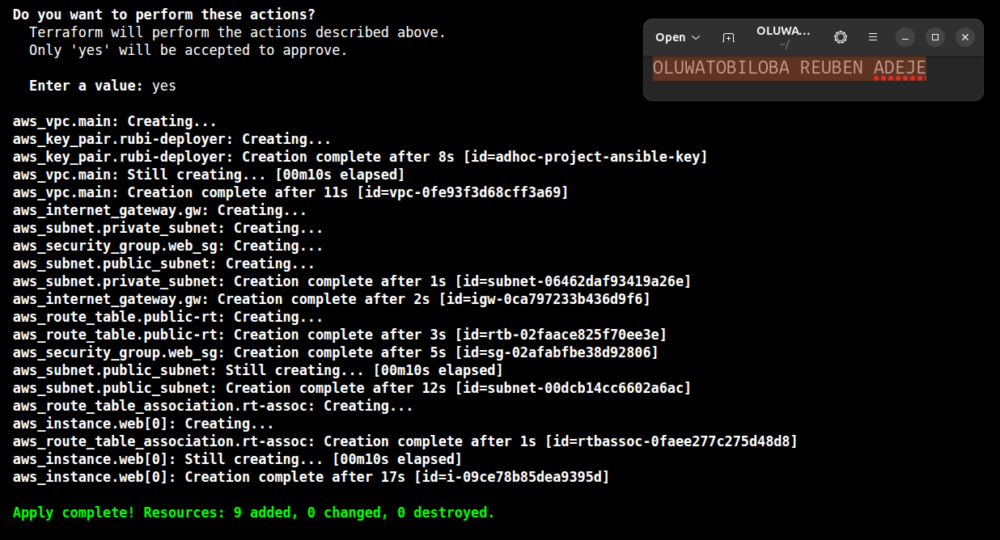

---

#### Screenshot 5 — Output of `terraform output public_ip` showing the VM’s public IP address

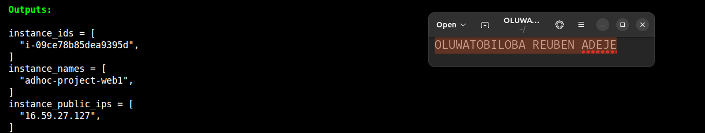

---

### Notes

Add your task notes here.

---

# Task 4 — Verify Passwordless SSH Access

## Goal

Confirm that the Ansible controller can connect to the Terraform-provisioned Azure VM using SSH key authentication.

### Evidence

#### Screenshot 6 — Passwordless SSH command and the returned `mini-finance` hostname

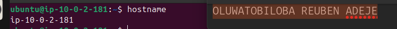

---

### Notes

Add your task notes here.

---

# Task 5 — Create the Ansible Inventory and Verify Connectivity

## Goal

Add the Terraform-provisioned Azure VM to the Ansible inventory and confirm that Ansible can connect to it.

### Evidence

#### Screenshot 7 — Ansible ping output showing `SUCCESS` and `pong` from the Azure VM

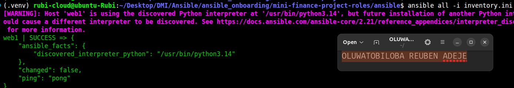

---

### Configuration File

Copy and paste the complete contents of your `ansible/inventory.ini` file below:

```ini
[web]
web1 ansible_host=16.59.27.127

[all:vars]
ansible_user=ubuntu
ansible_ssh_private_key_file=/home/rubi-cloud/.ssh/ansible
```

---

# Task 6 — Create the Multi-Play Ansible Playbook

## Goal

Create one Ansible playbook containing separate plays to install Nginx, deploy the Mini Finance website, and verify the deployment.

### Evidence

#### Screenshot 8 — `site.yml` showing Play 1 and the beginning of Play 2

Screenshot must show:

- Play 1 targeting the `web` group
- Installation of `nginx`, `git`, and `rsync`
- Nginx service configured as started and enabled
- Beginning of Play 2 with the Git repository URL and synchronization task

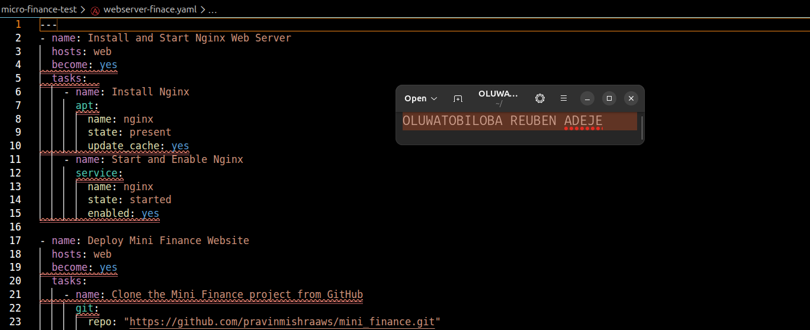

---

#### Screenshot 9 — `site.yml` showing the deployment destination, handler, and Play 3 verification

Screenshot must show:

- Website destination `/var/www/html/`
- Ownership set to `www-data:www-data`
- Nginx reload handler
- Play 3 targeting `localhost`
- The `uri` verification and `assert` condition

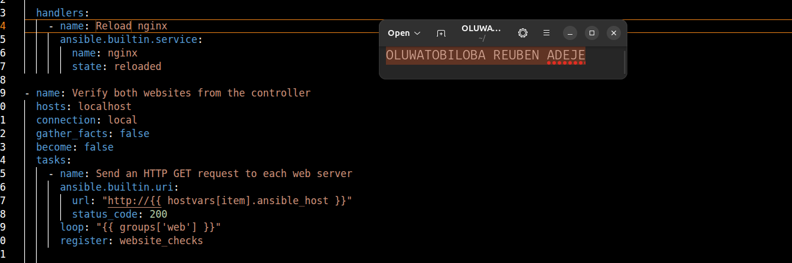

---

### Configuration File

Copy and paste the complete contents of your `ansible/site.yml` file below:

```yaml
---
- name: Install and Start Nginx Web Server
  hosts: web
  become: yes
  tasks:  
    - name: Install Nginx
      apt:
        name: nginx
        state: present
        update_cache: yes
    - name: Start and Enable Nginx
      service:
        name: nginx
        state: started
        enabled: yes

- name: Deploy Mini Finance Website
  hosts: web
  become: yes
  tasks:
    - name: Clone the Mini Finance project from GitHub
      git:
        repo: "https://github.com/pravinmishraaws/mini_finance.git"
        dest: "/tmp/mini_finance"

    - name: Copy website content to web server root
      copy:
        src: "/tmp/mini_finance/"
        dest: "/var/www/html/"
        owner: www-data
        group: www-data
        mode: "0755"
        remote_src: yes

- name: Configure Nginx to Serve the Site
  hosts: web
  become: yes
  tasks:
    - name: Overwrite default Nginx site configuration
      copy:
        dest: /etc/nginx/sites-available/default
        content: |
          server {
            listen 80;
            server_name _;
            root /var/www/html;
            index index.html;
            location / {
              try_files $uri /index.html;
            }
            error_page 404 /index.html;
          }
        owner: root
        group: root
        mode: "0644"

  handlers:
    - name: Reload nginx
      ansible.builtin.service:
        name: nginx
        state: reloaded      

# - name: Restart Nginx After Configuration
#   hosts: web
#   become: yes
#   tasks:
#     - name: Restart Nginx to apply changes
#       service:
#         name: nginx
#         state: restarted

- name: Verify both websites from the controller
  hosts: localhost
  connection: local
  gather_facts: false
  become: false
  tasks:
    - name: Send an HTTP GET request to each web server
      ansible.builtin.uri:
        url: "http://{{ hostvars[item].ansible_host }}"
        status_code: 200
      loop: "{{ groups['web'] }}"
      register: website_checks

    - name: Confirm each server returned HTTP 200
      ansible.builtin.assert:
        that:
          - item.status == 200
        success_msg: "{{ item.item }} returned HTTP {{ item.status }}"
      loop: "{{ website_checks.results }}"


```

---

# Task 7 — Validate and Run the Ansible Playbook

## Goal

Validate the syntax of the multi-play Ansible playbook and run it to install Nginx, deploy the Mini Finance website, and verify the deployment.

### Evidence

#### Screenshot 10 — Successful playbook syntax check showing `playbook: site.yml`

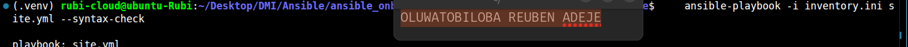

---

#### Screenshot 11 — Play 3 output showing the successful HTTP verification and assertion

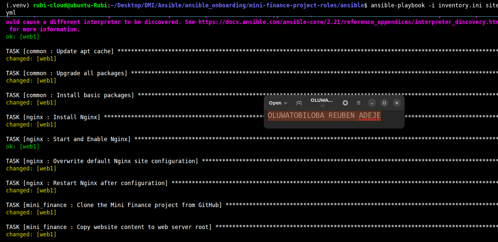

---

#### Screenshot 12 — Final `PLAY RECAP` showing `failed=0` and `unreachable=0`

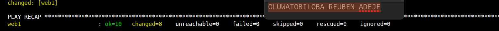

---

### Notes

Add your task notes here.

---

# Task 8 — Test the Mini Finance Website in a Browser

## Goal

Confirm that the Mini Finance website is publicly accessible through the Azure VM’s public IP address.

### Evidence

#### Screenshot 13 — Mini Finance website successfully loading in the browser, with the Azure VM’s public IP address visible in the address bar

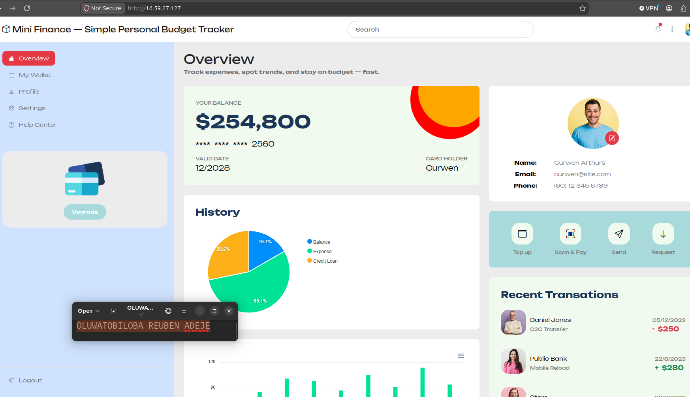

---

### Website URL

Add your deployed website URL below:

```text
http://16.59.27.127/
```

---

# Task 9 — Create the Project README

## Goal

Create a `README.md` file to document the Mini Finance infrastructure and deployment project.

### Evidence

#### Screenshot 14 — Completed `README.md` displayed in the VS Code Markdown preview or terminal

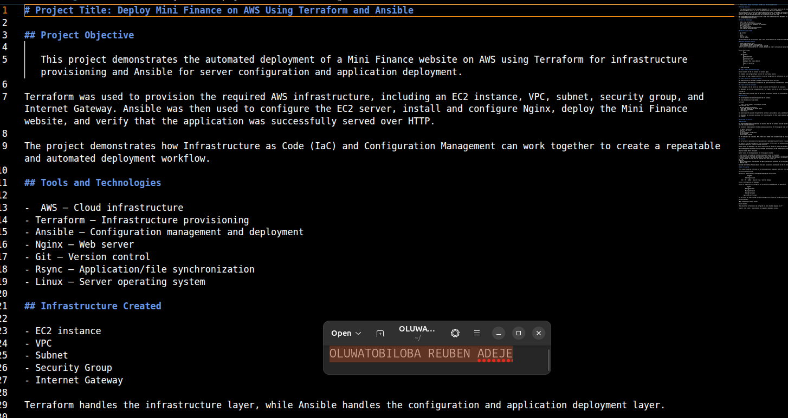

---

### README Content

Copy and paste the complete contents of your `README.md` file below:

```markdown
# Project Title: Deploy Mini Finance on AWS Using Terraform and Ansible

## Project Objective

   This project demonstrates the automated deployment of a Mini Finance website on AWS using Terraform for infrastructure provisioning and Ansible for server configuration and application deployment.

Terraform was used to provision the required AWS infrastructure, including an EC2 instance, VPC, subnet, security group, and Internet Gateway. Ansible was then used to configure the EC2 server, install and configure Nginx, deploy the Mini Finance website, and verify that the application was successfully served over HTTP.

The project demonstrates how Infrastructure as Code (IaC) and Configuration Management can work together to create a repeatable and automated deployment workflow. 

## Tools and Technologies

-  AWS — Cloud infrastructure
- Terraform — Infrastructure provisioning
- Ansible — Configuration management and deployment
- Nginx — Web server
- Git — Version control
- Rsync — Application/file synchronization
- Linux — Server operating system 

## Infrastructure Created

- EC2 instance
- VPC
- Subnet
- Security Group
- Internet Gateway

Terraform handles the infrastructure layer, while Ansible handles the configuration and application deployment layer. 

## Ansible Deployment Workflow

- Install and configure Nginx
- Clone and deploy the Mini Finance website
- Verify that the website returns HTTP status code 200
 After Terraform provisioned the EC2 instance, Ansible was used to configure and deploy the application.

```
Ansible Control Node
        │
        │ SSH
        ▼
    EC2 Instance
        │
        ├── Install Nginx
        │
        ├── Configure Nginx
        │
        ├── Deploy Mini Finance Website
        │
        └── Verify Web Server
        │
        ▼

    HTTP Status 200
```
### step1. Install and Configure Nginx

Ansible connects to the EC2 instance and installs Nginx.

The playbook also configures Nginx to serve the Mini Finance website.

This removes the need to manually SSH into the server and perform the installation and configuration steps.

### step2. Deploy the Mini Finance Website

The website files are deployed to the EC2 instance using Ansible and rsync.

This provides an efficient way to synchronize the application files from the Ansible control node to the remote server.

### step3. Verify the Deployment

After deployment, the web server was tested to confirm that the website was accessible.

The deployment was verified using Ansible and a web browser, with the web server returning:

HTTP 200 OK

An HTTP 200 response confirms that the web server successfully received and processed the request.

## Verification

The Ansible playbook was executed against the EC2 instance.

The final Ansible play recap showed:

PLAY RECAP

     web1 : ok=10 changed=8 unreachable=0 failed=0
This indicates that:

- 10 tasks completed successfully.
- 8 tasks made changes to the target server.
- 0 hosts were unreachable.
- 0 tasks failed.

The website was then accessed through the EC2 instance's public address using a web browser.

The deployment was considered successful after confirming that the Mini Finance website loaded correctly and returned an HTTP 200 response.


## Challenge and Solution

 ### Challenge

One important deployment consideration was ensuring that the EC2 instance could be reached by Ansible and that the web server could be accessed externally.

For Ansible to communicate with the EC2 instance successfully, the following had to be correctly configured:

- EC2 public connectivity
- Security Group rules
- SSH access
- Correct inventory configuration
- SSH private key
- Correct remote username

For the website to be accessible, HTTP traffic also needed to be allowed through the Security Group.

### Solution

The infrastructure and connectivity requirements were handled during the Terraform provisioning process.

The Security Group was configured to allow the necessary traffic, while the Ansible inventory contained the EC2 instance information required to establish the SSH connection.

Before running the deployment, the server connectivity was checked to ensure that Ansible could reach the target host.

This helped prevent deployment failures caused by infrastructure or SSH configuration issues.

Important Checks Before Deployment

Before running the Ansible playbook, the following were checked:

1. EC2 Instance: Confirmed that the EC2 instance was running and reachable.
2. SSH Connectivity: Confirmed that the Ansible control node could connect to the EC2 instance using SSH.
3. Ansible Inventory: Verified that the EC2 instance was correctly defined in the Ansible inventory.
4. Security Group: Verified that the required ports were allowed for:
SSH — 22
HTTP — 80
5. Nginx Configuration: Confirmed that the Nginx configuration pointed to the correct website directory.
6. Website Files

Verified that the Mini Finance website files were successfully synchronized to the EC2 instance. 

## What You Learned

 This project helped me understand how Terraform and Ansible complement each other in a real-world DevOps workflow.

Terraform — Infrastructure

Terraform is responsible for creating and managing the infrastructure.

                Terraform
                   ↓
            AWS Infrastructure
                   ↓
     EC2 + VPC + Subnet + Security Group + Internet Gateway

Ansible — Configuration and Deployment

Ansible is responsible for configuring the infrastructure and deploying the application.

               Ansible
                  ↓
            EC2 Configuration
                  ↓
            Nginx Installation
                  ↓
            Website Deployment
                  ↓
         Application Verification

The key lesson was understanding that provisioning infrastructure and configuring infrastructure are separate responsibilities.

Terraform answers:

"What infrastructure should exist?"

Ansible answers:

"How should that infrastructure be configured and what should be deployed on it?"

Together, they create a more automated and repeatable deployment process. 
    
```

---

# LinkedIn Post Required

## Evidence

#### Screenshot 15 — Published LinkedIn post showing the text and at least one deployment screenshot

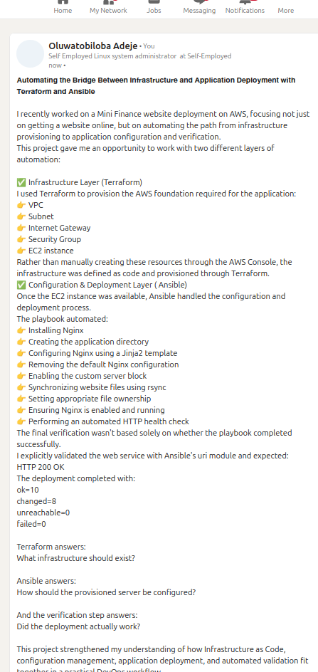

---

#### LinkedIn Post URL

Paste your LinkedIn post URL here:

`https://www.linkedin.com/posts/oluwatobiloba-adeje-2572b42a6_devops-aws-terraform-ugcPost-7507808622559776769-tefO/?utm_source=share&utm_medium=member_desktop&rcm=ACoAAEm6D2MBiHlTtqXxAdNL2_2Taiskof8w_Lw`

---

### LinkedIn Submission Notes

**One challenge you faced and how you fixed it:**

No challenge encountered

---

**One real-world example where you can use this learning:**

In an enterprise continuous deployment setup, this pattern allows team members to automatically spin up temporary, isolated staging environments for feature testing. Terraform provisions identical infrastructure on demand, while Ansible configures the web application and verifies health status with an automated HTTP 200 check, eliminating manual setup overhead and reducing configuration drift between testing and production.

---

# Assignment Questions

Answer the following in your own words:

**1. What did you provision using Terraform in this assignment?**

- EC2 instance
- VPC
- Subnet
- Security Group
- Internet Gateway


---

**2. What did Ansible configure and deploy in this assignment?**

- Install and configure Nginx
- Clone and deploy the Mini Finance website
- Verify that the website returns HTTP status code 200
 After Terraform provisioned the EC2 instance, Ansible was used to configure and deploy the application.

---

**3. Why is SSH access on port `22` restricted to your public IP address?**

Restricting SSH access on port 22 to a specific public IP address (/32 CIDR) follows the principle of least privilege. It prevents unauthorized access, limits exposure to internet-wide automated brute-force attacks, and ensures administrative access is only permitted from trusted networks.

---

**4. Why is HTTP port `80` open to the internet?**

HTTP port 80 is open to the internet (0.0.0.0/0) so that public users can access the hosted web application via standard web browsers without administrative restrictions.   

---

**5. What is the purpose of the Ansible inventory file?**

The Ansible inventory file acts as a target repository that defines the hostnames, IP addresses, groups, and SSH connection parameters for the managed nodes Ansible will configure and manage.

---

**6. Why does the playbook use separate plays for install, deploy, and verify?**

Separating tasks into distinct plays enforces modularity, logical execution flow, and clear separation of concerns. It allows isolated execution, easier troubleshooting, targeted execution using tags, and ensures health verification runs only after infrastructure configuration is complete

---

**7. Why is `rsync` useful when deploying website files?**

rsync efficiently synchronizes website files by transferring only changed or missing files rather than re-uploading the entire codebase. It preserves file permissions, timestamps, and directory structures, reducing bandwidth usage and deployment time.

---

**8. What does the Ansible `uri` module verify in this assignment?**

The uri module makes an HTTP GET request to the deployed EC2 server's IP address and verifies that the web service returns an expected HTTP 200 OK status code, confirming the website is live and publicly accessible

---

**9. What issue did you face during this assignment, and how did you fix it?**

No issue encountered

---

**10. What did you learn from using Terraform and Ansible together?**

I learned the power of separation of concerns in DevOps: Terraform handles declarative infrastructure provisioning (VPC, Security Groups, EC2), while Ansible manages procedural server configuration (Nginx setup, file deployments, and service health checks). Using both tools together creates a fully automated, repeatable deployment pipeline.

---

# Required Files

Confirm that the following files are included in your assignment folder:

- [x] `.gitignore`
- [x] `README.md`
- [x] `terraform/providers.tf`
- [x] `terraform/main.tf`
- [x] `terraform/variables.tf`
- [x] `terraform/outputs.tf`
- [x] `ansible/inventory.ini`
- [x] `ansible/site.yml`

---

# Submission Instructions

- Add all required screenshots in the correct order.
- Full Name must be visible in required screenshots.
- Add the Azure VM public IP address.
- Add the final Mini Finance website URL.
- Paste `inventory.ini`, `site.yml`, and `README.md` as editable text.
- Answer all assignment questions clearly in your own words.
- Add your LinkedIn post URL.
- Do not expose SSH private keys, passwords, Azure credentials, subscription IDs, Terraform state contents, or other sensitive information.

---

# Completion Checklist

- [x] Task 1: `mini-finance` project structure created
- [x] Task 1: `.gitignore` created
- [x] Task 2: Terraform Azure infrastructure code created
- [x] Task 2: `Allow-SSH` rule configured for port `22`
- [x] Task 2: `Allow-HTTP` rule configured for port `80`
- [x] Task 2: NSG associated with the Network Interface
- [x] Task 3: `terraform fmt` completed
- [x] Task 3: `terraform init` completed
- [x] Task 3: `terraform validate` completed successfully
- [x] Task 3: `terraform apply` completed successfully
- [x] Task 3: `terraform output public_ip` displayed the VM public IP
- [x] Task 4: Passwordless SSH works from the Ansible controller
- [x] Task 5: `inventory.ini` created
- [x] Task 5: Ansible ping returns `SUCCESS` and `pong`
- [x] Task 6: `site.yml` contains three separate plays
- [x] Task 6: Play 1 installs Nginx, Git, and rsync
- [x] Task 6: Play 2 clones and deploys the Mini Finance website
- [x] Task 6: Play 3 verifies HTTP status code `200`
- [x] Task 7: Playbook syntax check passes
- [x] Task 7: Ansible playbook completes successfully
- [x] Task 7: Final recap shows `failed=0` and `unreachable=0`
- [x] Task 8: Mini Finance website loads in the browser
- [x] Task 8: Azure VM public IP is visible in the browser screenshot
- [x] Task 9: `README.md` completed
- [x] Screenshots 1–15 are included
- [x] `inventory.ini`, `site.yml`, and `README.md` are pasted as editable text
- [x] Assignment questions are answered
- [x] LinkedIn post published with Anyone visibility
- [x] LinkedIn post URL added
- [x] No sensitive information is exposed

---

## About DMI & CloudAdvisory

DevOps Micro Internship (DMI) is a project-based DevOps program run by Pravin Mishra and The CloudAdvisory, focused on real-world execution, systems thinking, and career readiness.

It helps learners build strong DevOps foundations with hands-on experience.

---

## Resources

- DMI Official Website: [https://dmi.pravinmishra.com?utm_source=github&utm_medium=readme](https://dmi.pravinmishra.com?utm_source=github&utm_medium=readme)
- University: [https://university.pravinmishra.com?utm_source=github&utm_medium=readme](https://university.pravinmishra.com?utm_source=github&utm_medium=readme)
- Discord Community: [https://discord.pravinmishra.com?utm_source=github&utm_medium=readme](https://discord.pravinmishra.com?utm_source=github&utm_medium=readme)
- Blog: [https://dmi.pravinmishra.com/blog?utm_source=github&utm_medium=readme](https://dmi.pravinmishra.com/blog?utm_source=github&utm_medium=readme)
- YouTube Playlist: [https://www.youtube.com/playlist?list=PLFeSNDtI4Cho](https://www.youtube.com/playlist?list=PLFeSNDtI4Cho)
- Pravin Mishra LinkedIn: [https://www.linkedin.com/in/pravin-mishra-aws-trainer/](https://www.linkedin.com/in/pravin-mishra-aws-trainer/)
- CloudAdvisory LinkedIn: [https://www.linkedin.com/company/thecloudadvisory/](https://www.linkedin.com/company/thecloudadvisory/)

---

*This submission is part of DevOps Micro Internship (DMI) — Agentic AI Track.*