# Assignment — Deploy EpicBook with Terraform and Ansible Roles

Part of the DevOps Micro Internship (DMI) with Agentic AI

---

## Purpose

In this assignment, you will deploy the EpicBook web application using Terraform and Ansible roles.

Terraform provisions the cloud infrastructure, including one Ubuntu VM and one managed MySQL database. Ansible roles configure the VM, install required software, deploy the EpicBook application, configure Nginx, connect the app to the managed MySQL database, and verify the deployment.

---

# Task 1 — Set Up the Project Folder Layout

## Goal

Create the project folder structure for Terraform and Ansible roles.

Terraform will be used to provision the cloud infrastructure. Ansible roles will be used to configure the VM and deploy the EpicBook application.

### Evidence

#### Screenshot 1 — Terminal showing the completed `epicbook-prod` project structure

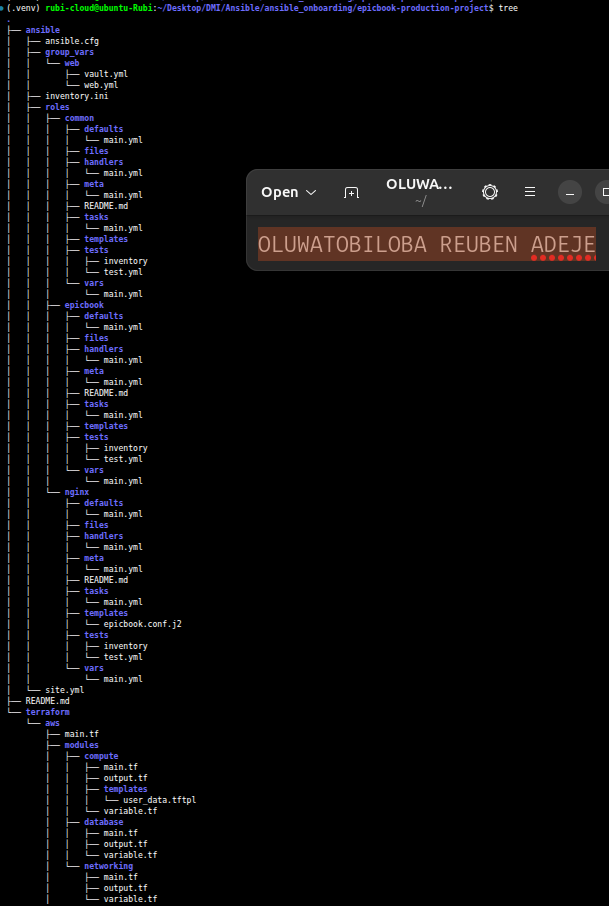

---

### Notes

Answer the following in your own words:

**1. Which cloud provider did you choose for this assignment?**

AWS Cloud Provider

---

**2. Why is it useful to keep Terraform files and Ansible files in separate folders?**

Keeping Terraform and Ansible files in separate folders keeps the project organized and easier to manage.
Terraform is used to create infrastructure, while Ansible is used to configure servers.
It also makes troubleshooting easier because each tool has a clear responsibility.
This separation helps teams maintain and automate infrastructure more efficiently.

---

**3. What is the purpose of the `roles` directory in Ansible?**

The roles directory in Ansible is used to organize reusable automation tasks.
Each role can manage a specific function, such as installing Nginx or configuring a database.
It keeps playbooks clean, modular, and easier to maintain.

---

# Task 2 — Provision the Infrastructure with Terraform

## Goal

Run Terraform to provision the cloud infrastructure for the EpicBook deployment.

Terraform will create the VM, managed MySQL database, networking, security rules, and required outputs.

### Evidence

#### Screenshot 2 — `terraform apply` completed successfully

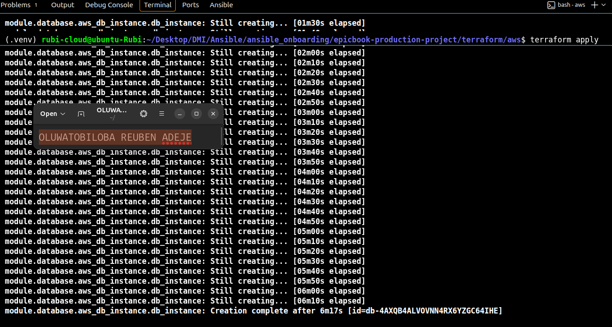

---

#### Screenshot 3 — Output of `terraform output`

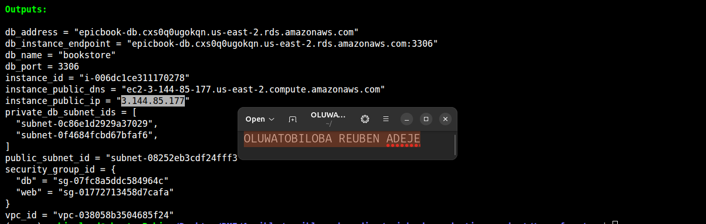

---

#### Screenshot 4 — Azure Portal or AWS Console showing the VM running

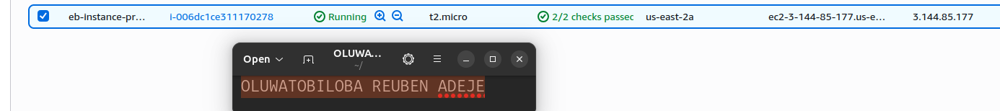

---

#### Screenshot 5 — Azure Portal or AWS Console showing the managed MySQL database created

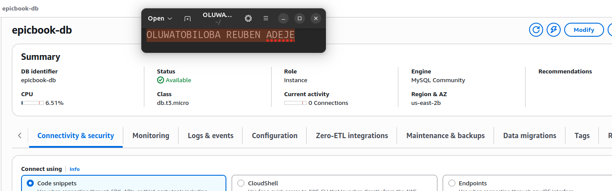

---

### Notes

Answer the following in your own words:

**1. What resources did Terraform create for this assignment?**

- VPC
- SUBNET
- INTERNET GATEWAY
- RDS DATABSE
- EC2 INSTANCE
- SECURITY GROUP
- ROUTE TABLE
- KEY PAIR
- DATABSE SUBNET GROUP

---

**2. Why should you review `terraform plan` before running `terraform apply`?**

terraform plan shows what changes Terraform will make before applying them.
Reviewing it helps you catch unexpected resource creation, modification, or deletion.
This reduces the risk of accidental infrastructure changes or downtime.

---

**3. Why should database passwords not be shown in Terraform output?**

Database passwords should not appear in Terraform output because they are sensitive credentials.
Exposing them can allow unauthorized users to access the database.
Keeping them hidden helps protect security and confidential information.

---

# Task 3 — Verify SSH Key-Based Access

## Goal

Verify that the cloud VM can be accessed from the Ansible controller using SSH key-based authentication.

### Evidence

#### Screenshot 6 — Successful SSH hostname check from the Ansible controller

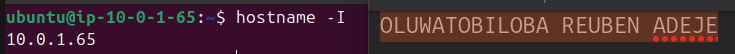

---

### Notes

Answer the following in your own words:

**1. What command did you use to verify SSH access?**

ssh -i key-pair ubuntu@ip

---

**2. What proves that SSH key-based access worked successfully?**

A successful SSH login without being prompted for a password proves that key-based access worked.

---

**3. What would you check if SSH returned `Permission denied (publickey)`?**

I will check the folllowing

- Check that the correct private key is being used and has proper permissions.
- Verify the public key is in the server’s ~/.ssh/authorized_keys.
- Confirm the SSH username and server IP are correct.
- Check the SSH configuration and server logs for authentication errors.
- Check my security group inbound SSH traffic if my IP is allowed  

---

# Task 4 — Create the Ansible Inventory and Configuration

## Goal

Create the Ansible inventory file and local Ansible configuration for the EpicBook VM.

The inventory tells Ansible which VM to manage and which SSH user to use.

### Evidence

#### Screenshot 7 — `inventory.ini` showing the VM under the `web` group

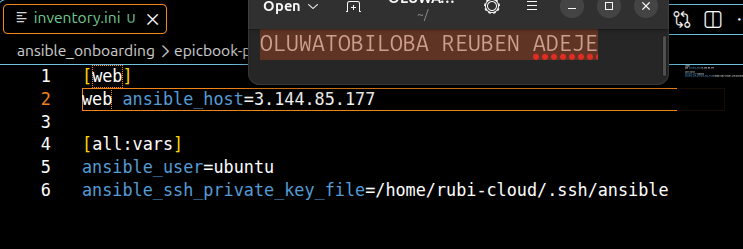

---

#### Screenshot 8 — Output of `ansible-inventory -i inventory.ini --graph`

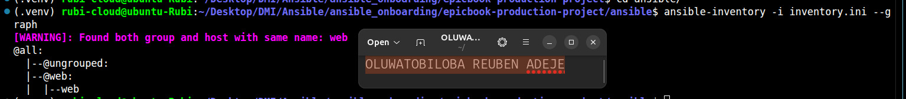

---

#### Screenshot 9 — Output of `ansible web -i inventory.ini -m ping`

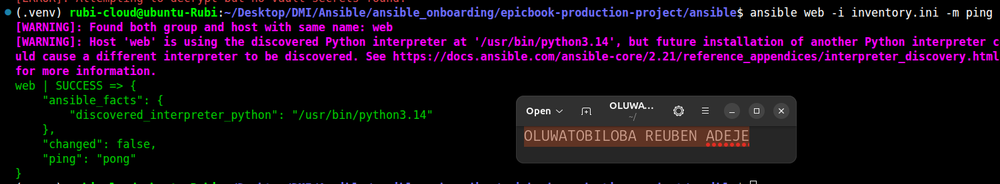

---

### Notes

Answer the following in your own words:

**1. What is the purpose of `inventory.ini`?**

inventory.ini tells Ansible which servers to manage.
It contains the servers’ IP addresses, hostnames, and connection details.
It allows Ansible to know where to run playbooks and tasks.

---

**2. What does `ansible_host` store?**

ansible_host stores the IP address or hostname of the target server.
It tells Ansible where to connect using SSH.

---

**3. What does `ansible_ssh_private_key_file` tell Ansible?**

ansible_ssh_private_key_file tells Ansible which private SSH key to use when connecting to a server.
It allows Ansible to authenticate securely using key-based SSH access.

---

**4. Why is `host_key_checking = False` used only for this temporary lab?**

host_key_checking = False skips SSH host-key verification, making a temporary lab easier to set up.
It is not recommended for production because it can weaken SSH security and allow connections to an untrusted host.

---

# Task 5 — Create the Main Ansible Playbook

## Goal

Create the main Ansible playbook that runs the required roles in the correct order.

The `site.yml` file will call the `common`, `nginx`, and `epicbook` roles.

### Evidence

#### Screenshot 10 — `site.yml` showing the roles in the correct order

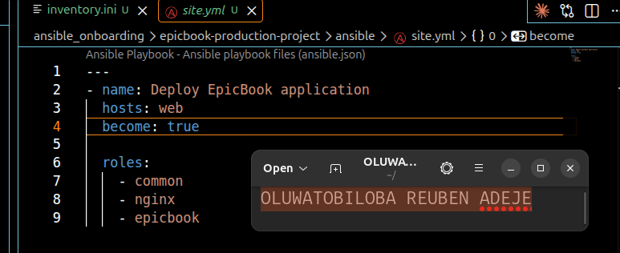

---

#### Screenshot 11 — Output of `ansible-playbook -i inventory.ini site.yml --syntax-check`

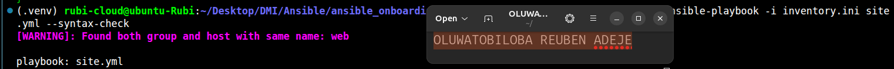

---

### Notes

Answer the following in your own words:

**1. What is the purpose of `site.yml`?**

site.yml is the main Ansible playbook that defines what tasks should be run on the servers.
It can call different roles to configure and manage the infrastructure.

---

**2. Why should the roles run in the order `common`, `nginx`, and `epicbook`?**

The roles should run in that order because each step depends on the previous one.
common sets up basic requirements, nginx installs/configures the web server, and epicbook deploys the application.
This ensures the server is properly prepared before the application is deployed.

---

**3. What does `become: true` allow Ansible to do?**

become: true allows Ansible to run tasks with elevated privileges, usually as the root user.
It is commonly needed for tasks like installing packages or modifying system files.

---

# Task 6 — Create the `common` Role

## Goal

Create the `common` role to prepare the Ubuntu VM with the basic packages required for the EpicBook deployment.

This role handles the common server setup before Nginx and the application are configured.

### Evidence

#### Screenshot 12 — `roles/common/tasks/main.yml` showing the common setup tasks

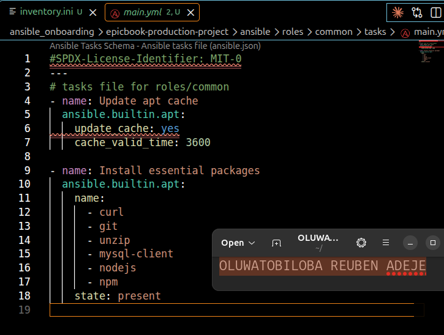

---

### Notes

Answer the following in your own words:

**1. What is the responsibility of the `common` role?**

The common role handles basic server setup and common requirements.
It may install essential packages, create users, and configure basic system settings.
This prepares the server for the other roles.

---

**2. Why should Nginx installation not be placed inside the `common` role?**

Nginx should not be in common because it is a specific web-server service, not a basic server requirement.
Keeping it separate makes roles modular, reusable, and easier to maintain.

---

**3. Why is `mysql-client` useful in this deployment?**

mysql-client allows the application server to connect to and interact with a MySQL database.
It provides tools needed to run queries and test database connectivity.
---

# Task 7 — Create the `nginx` Role

## Goal

Create the `nginx` role to install Nginx and configure it as a reverse proxy for the EpicBook application.

Nginx will receive browser traffic on port `80` and forward it to the EpicBook Node.js application running on the VM.

### Evidence

#### Screenshot 13 — `roles/nginx/tasks/main.yml` showing Nginx installation and site configuration tasks

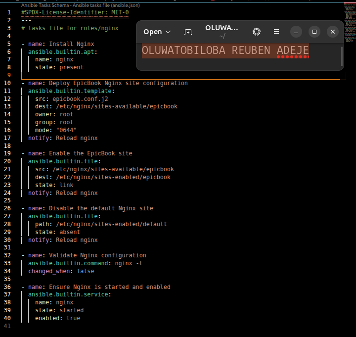

---

#### Screenshot 14 — `roles/nginx/templates/epicbook.conf.j2` showing the reverse proxy configuration

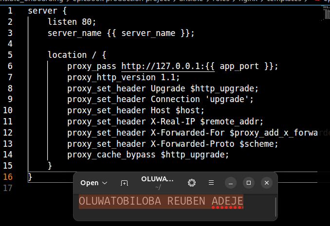

---

### Notes

Answer the following in your own words:

**1. What is the responsibility of the `nginx` role?**

The nginx role is responsible for installing and configuring Nginx on the server.
It can also start and enable the Nginx service.
This prepares Nginx to serve or proxy the application.

---

**2. Why is Nginx configured as a reverse proxy in this deployment?**

Nginx is used as a reverse proxy to receive client requests and forward them to the application server.
It keeps the application behind Nginx and provides a single public entry point.
It can also handle tasks like routing requests and serving static files.

---

**3. Why should the application port come from `group_vars/web.yml` instead of being hard-coded?**

The application port should come from group_vars/web.yml to make the configuration flexible and reusable.
It allows you to change the port without editing the role or playbook.
This makes the deployment easier to maintain across different environments.

---

# Task 8 — Create the `epicbook` Role

## Goal

Create the `epicbook` role to deploy the EpicBook application, connect it to the managed MySQL database, and run the application on port `8080` using PM2.

### Evidence

#### Screenshot 15 — `roles/epicbook/tasks/main.yml` showing application deployment tasks

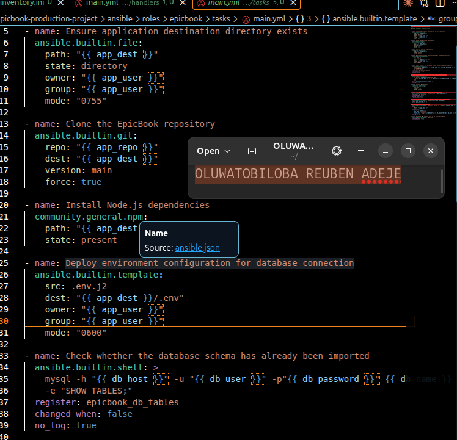

---

#### Screenshot 16 — Task or file showing how the database connection is configured, with secrets hidden

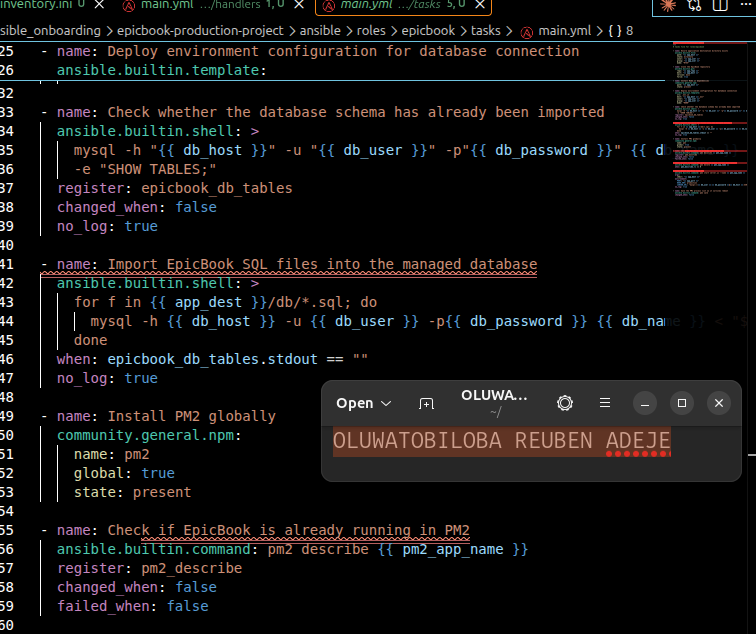

---

#### Screenshot 17 — Task or output showing the EpicBook application managed by PM2

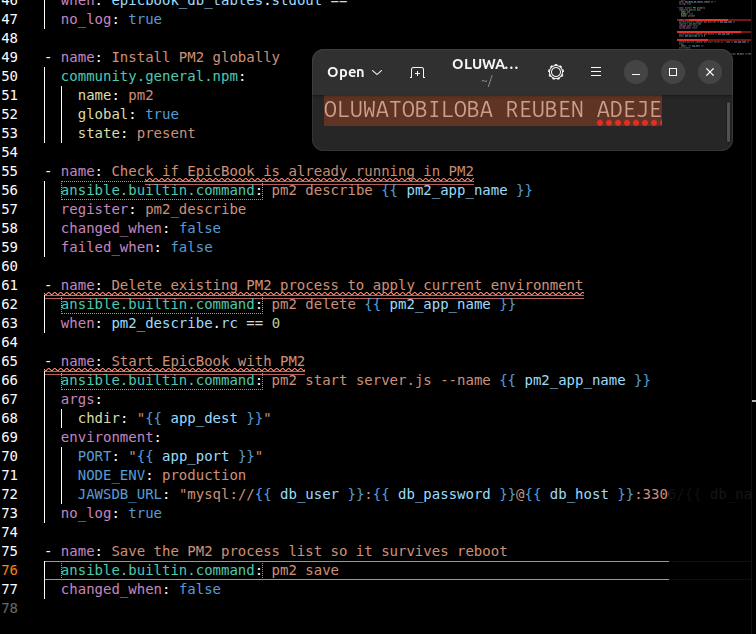

---

### Notes

Answer the following in your own words:

**1. What is the responsibility of the `epicbook` role?**

The epicbook role is responsible for deploying and configuring the EpicBook application.
It can install dependencies, copy application files, configure settings, and start the application.

---

**2. Why is PM2 used for the EpicBook Node.js application?**

PM2 is used to manage and run the Node.js application as a background service.
It can automatically restart the app if it crashes and keep it running continuously.

---

**3. Why should database passwords not be hard-coded in public files?**

Database passwords should not be hard-coded because they are sensitive credentials.
Public files can expose them to unauthorized users.
Using Ansible Vault or environment variables helps keep passwords secure.

---

**4. What does it mean for the application to run on port `8080` while Nginx listens on port `80`?**

The application runs internally on port 8080, while Nginx accepts public requests on port 80.
Nginx acts as a reverse proxy, forwarding requests from port 80 to the application on port 8080.

---

# Task 9 — Create Group Variables

## Goal

Create reusable variables for the EpicBook deployment.

The `group_vars/web.yml` file stores values that can be reused across the Ansible roles.

### Evidence

#### Screenshot 18 — `group_vars/web.yml` showing the application, PM2, and database variables, with passwords hidden or masked

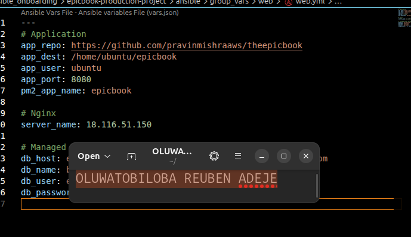

---

### Notes

Answer the following in your own words:

**1. What is the purpose of `group_vars/web.yml`?**

group_vars/web.yml stores variables shared by the web servers in an Ansible inventory group.
It keeps settings like the application port separate from the playbooks and roles.
This makes the configuration easier to manage and change.

---

**2. Which values did you store in `group_vars/web.yml`?**

The main value stored in group_vars/web.yml is the application port, such as 8080 and Database credentials .

---

**3. How did you handle the database password securely?**

I handled the database password securely by using Ansible Vault instead of hard-coding it in public files.
This keeps the password encrypted and protected while allowing Ansible to use it during deployment.

---

# Task 10 — Run the Ansible Playbook

## Goal

Run the Ansible playbook to configure the VM and deploy the EpicBook application.

The playbook should run the roles in this order:

1. `common`
2. `nginx`
3. `epicbook`

### Evidence

#### Screenshot 19 — Ansible playbook output showing the roles running

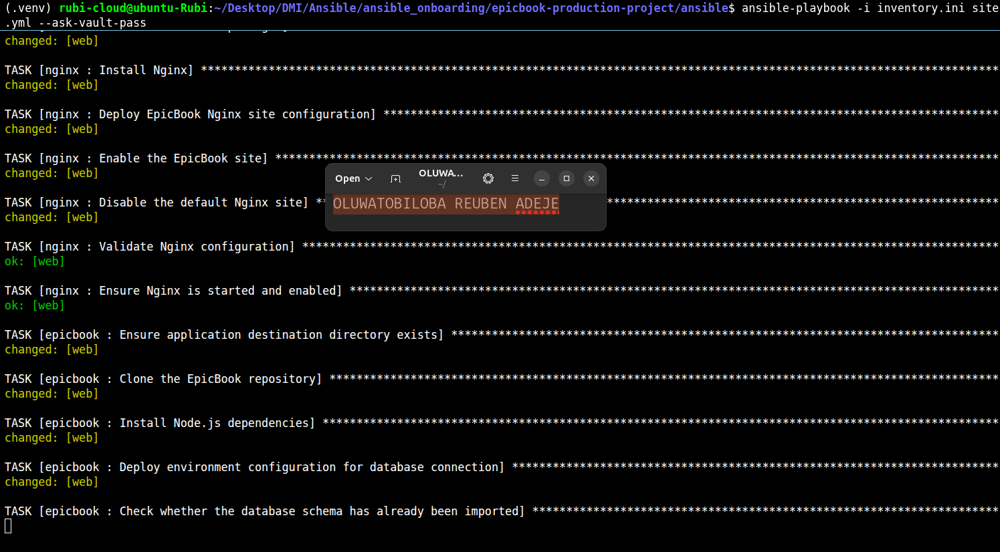

---

#### Screenshot 20 — Final Ansible recap showing `failed=0`

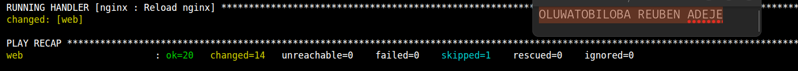

---

#### Screenshot 21 — Output of `ansible web -i inventory.ini -m command -a "systemctl is-active nginx" --become`

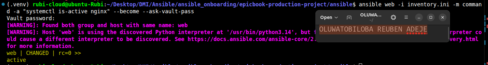

---

#### Screenshot 22 — Output of `ansible web -i inventory.ini -m command -a "pm2 status"`

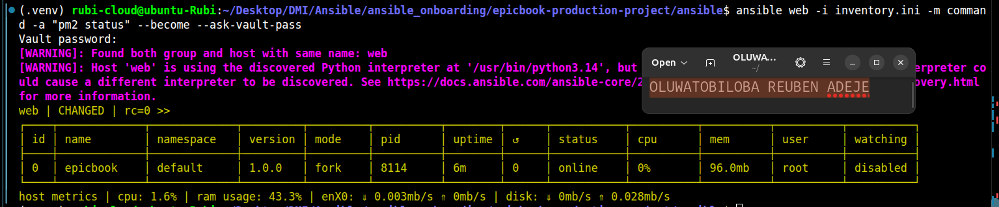

---

#### Screenshot 23 — Output of `ansible web -i inventory.ini -m command -a "curl -I http://localhost:8080"`

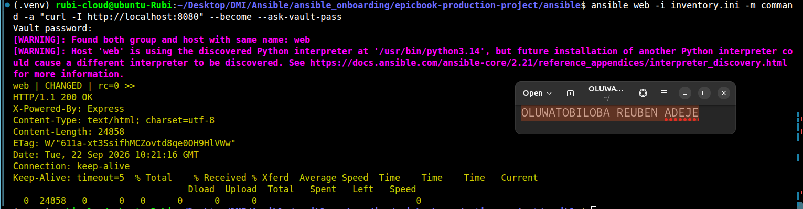

---

### Notes

Answer the following in your own words:

**1. What command did you run to execute the Ansible playbook?**

ansible-playbook -i inventory.ini site.yml --ask-vault-pass

---

**2. How do you know all roles completed successfully?**

You know the roles completed successfully when Ansible shows failed=0 in the final PLAY RECAP.
The output should also show changed, ok, and no failed tasks.

---

**3. What proves that Nginx is active?**

Nginx is active when its service status shows active (running).
A successful HTTP response on port 80 also confirms Nginx is responding.
---

**4. What proves that PM2 is managing the EpicBook application?**

PM2 is managing the EpicBook application when pm2 list shows the app with a online status.
This confirms PM2 is running and monitoring the application.

---

**5. What proves that the EpicBook application responds on port `8080`?**

The application responds on port 8080 if a request to that port returns a successful response.
A response from the EpicBook application proves it is running on port 8080.
---

# Task 11 — Verify the EpicBook Deployment

## Goal

Verify that the EpicBook application is running, accessible in the browser, and connected to the managed MySQL database.

### Evidence

#### Screenshot 24 — Output of `curl -I http://<public_ip>`

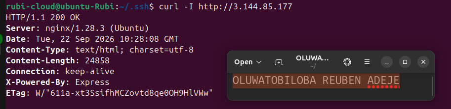

---

#### Screenshot 25 — Output of the cart API test command

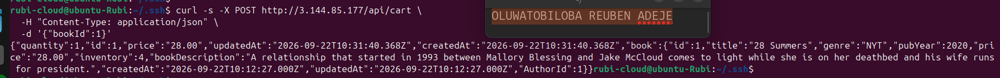

---

#### Screenshot 26 — Output of the `/cart` HTTP status check

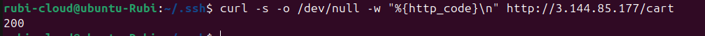

---

#### Screenshot 27 — Browser showing the EpicBook application loaded from `http://<public_ip>`

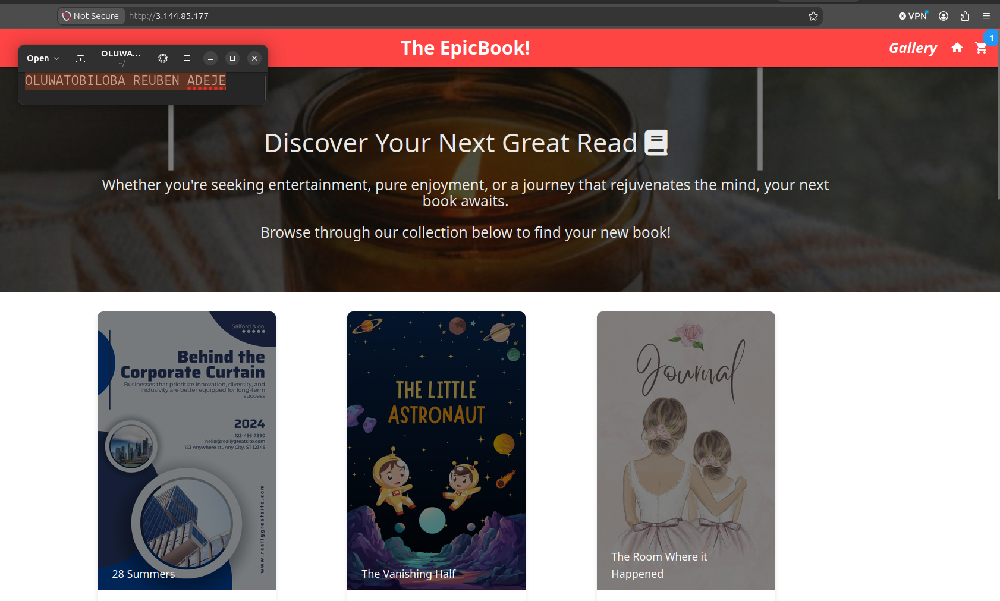

---

### Notes

Answer the following in your own words:

**1. What HTTP response did you receive from the public application URL?**

The public application URL returned an HTTP 200 OK response, confirming the application was accessible through Nginx.

---

**2. What did the cart API test prove?**

The cart API test proved that the EpicBook application was running correctly and its cart endpoint was accessible.
It also confirmed that requests were being successfully handled by the application.

---

**3. What did the `/cart` status check return?**

The /cart status check returned HTTP 200 OK, confirming that the cart endpoint was working correctly.
---

**4. What issue did you face during verification, and how did you fix it?**

The issue was that the application was not initially responding correctly on port 8080.
I checked the PM2 process and application configuration, corrected the issue, and restarted the application.
After that, the /cart endpoint returned HTTP 200 OK.

---

# LinkedIn Post Required

## Evidence

#### LinkedIn Post URL

Paste your LinkedIn post URL here:

`https://www.linkedin.com/posts/oluwatobiloba-adeje-2572b42a6_aws-terraform-ansible-ugcPost-7508122807386624000-7IUe/?utm_source=share&utm_medium=member_desktop&rcm=ACoAAEm6D2MBiHlTtqXxAdNL2_2Taiskof8w_Lw`

---

#### Screenshot — Published LinkedIn post

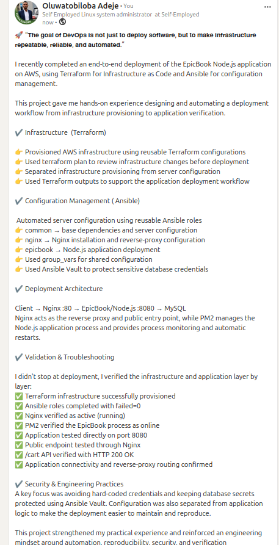
---

# Assignment Questions

Answer the following in your own words:

**1. Why is Terraform used for infrastructure provisioning?**

Terraform is used to provision and manage infrastructure using Infrastructure as Code (IaC).
It automates the creation, modification, and deletion of cloud resources.
Terraform provides consistency and repeatability across different environments.
It supports multiple cloud providers such as AWS, Azure, and Google Cloud.
It also tracks infrastructure changes using a state file.

---

**2. Why are Ansible roles useful for production-style deployments?**

Ansible roles organize automation into reusable and structured components.
They make playbooks easier to maintain, understand, and troubleshoot.
Roles allow teams to reuse the same configuration across different environments.
They support production deployments by separating tasks, variables, templates, and handlers.
This makes deployments consistent, scalable, and easier to manage.

---

**3. What is the purpose of `group_vars/web.yml`?**

group_vars/web.yml stores variables that apply to the web server group in Ansible.
It allows you to define shared settings for all hosts in that group.
It keeps configuration separate from the playbook, making it easier to manage.
For example, it can contain ports, package names, or application settings.
This improves organization, consistency, and reusability.

---

**4. Why should database passwords not be committed to GitHub?**

Database passwords should not be committed to GitHub because repositories can be public or accidentally exposed.
Attackers could use leaked passwords to access sensitive databases and data.
Git history can also preserve passwords even after they are deleted.
Instead, use Ansible Vault, environment variables, or a secrets manager.
This keeps credentials secure and separate from application code.

---

**5. What is the purpose of Nginx in this deployment?**

Nginx acts as a web server and reverse proxy in the deployment.
It receives client requests and forwards them to the application server.
It can handle HTTP/HTTPS traffic and serve static files efficiently.
Nginx also improves security, performance, and load handling.
This makes it useful for reliable production deployments.

---

**6. Why should the managed MySQL database not be publicly accessible?**

A managed MySQL database should not be publicly accessible because it increases the attack surface.
It could allow unauthorized users to attempt connections to the database.
Keeping it private limits access to trusted application servers or networks.
This helps protect sensitive data and database credentials.
It also follows the principle of least privilege for better security
---

**7. Why is PM2 used for the EpicBook Node.js application?**

PM2 is used to manage and run the Node.js application in production.
It can automatically restart the application if it crashes.
PM2 keeps the application running in the background.
It also provides process monitoring and logging.
This improves the application's reliability and availability.

---

**8. What does idempotency mean in Ansible?**

Idempotency means Ansible can run the same task multiple times without causing unwanted changes.
If the system is already in the desired state, Ansible makes no unnecessary changes.
For example, installing an already-installed package will not reinstall it.
This makes deployments safe, predictable, and repeatable.

---

**9. What issue did you face during the deployment, and how did you fix it?**

One issue I faced was the Node.js application not connecting properly to the MySQL database.
I checked the database credentials, host, port, and security-group settings.
I corrected the configuration and ensured the database was accessible from the application server.
After restarting the application with PM2, the connection worked successfully.

---

**10. What security improvement would you make before using this setup in production?**

I would store sensitive credentials in Ansible Vault or a secrets manager instead of plain text.
I would keep the MySQL database private and inaccessible from the public internet.
I would restrict access using firewalls and security groups.
I would also enable HTTPS/TLS and use strong, least-privilege permissions.
Finally, I would enable logging, monitoring, and regular security updates.

---

# Required Files

Confirm that the following files are included in your GitHub repository or assignment folder:

- [x] `README.md`
- [x] Terraform files under either `terraform/azure/` or `terraform/aws/`
- [x] `ansible/ansible.cfg`
- [x] `ansible/inventory.ini`
- [x] `ansible/site.yml`
- [x] `ansible/group_vars/web.yml`
- [x] `ansible/roles/common/tasks/main.yml`
- [x] `ansible/roles/nginx/tasks/main.yml`
- [x] `ansible/roles/nginx/templates/epicbook.conf.j2`
- [x] `ansible/roles/epicbook/tasks/main.yml`

---

# Submission Instructions

- Add all required screenshots in your submission.
- Full Name must be visible in required screenshots.
- Mention the cloud provider used: Azure or AWS.
- Add the VM public IP address.
- Add the final application URL.
- Add Terraform output proof.
- Add Ansible role tree proof.
- Add all required notes and assignment question answers.
- Add your LinkedIn post URL.
- Do not expose SSH private keys, passwords, cloud credentials, database credentials, Terraform state files, subscription IDs, or account IDs.

---

# Completion Checklist

- [x] Task 1: Project folder layout created
- [x] Task 2: Terraform infrastructure provisioned
- [x] Task 3: SSH key-based access verified
- [x] Task 4: Ansible inventory and configuration created
- [x] Task 5: Main Ansible playbook created
- [x] Task 6: `common` role created
- [x] Task 7: `nginx` role created
- [x] Task 8: `epicbook` role created
- [x] Task 9: Group variables created
- [x] Task 10: Ansible playbook run completed
- [x] Task 11: EpicBook deployment verified
- [x] Terraform files created under only one cloud provider folder
- [x] One Ubuntu VM was created
- [x] One managed MySQL database was created
- [x] SSH port `22` is restricted to the controller public IP
- [x] HTTP port `80` is accessible
- [x] MySQL port `3306` is not publicly open
- [x] `ansible web -i inventory.ini -m ping` returns `SUCCESS`
- [x] `site.yml` calls the roles in the correct order
- [x] Database secrets are hidden or handled securely
- [x] Nginx is active
- [x] PM2 shows the EpicBook application running
- [x] EpicBook responds on port `8080`
- [x] Public URL loads in the browser
- [x] Cart API verification works
- [x] Playbook completes with `failed=0`
- [x] Screenshots 1–27 are included
- [x] Assignment questions are answered
- [x] LinkedIn post published
- [x] LinkedIn post URL added
- [x] No sensitive information is exposed

---

## About DMI & CloudAdvisory

DevOps Micro Internship (DMI) is a project-based DevOps program run by Pravin Mishra and The CloudAdvisory, focused on real-world execution, systems thinking, and career readiness.

It helps learners build strong DevOps foundations with hands-on experience.

---

## Resources

- DMI Official Website: [https://dmi.pravinmishra.com?utm_source=github&utm_medium=readme](https://dmi.pravinmishra.com?utm_source=github&utm_medium=readme)
- University: [https://university.pravinmishra.com?utm_source=github&utm_medium=readme](https://university.pravinmishra.com?utm_source=github&utm_medium=readme)
- Discord Community: [https://discord.pravinmishra.com?utm_source=github&utm_medium=readme](https://discord.pravinmishra.com?utm_source=github&utm_medium=readme)
- Blog: [https://dmi.pravinmishra.com/blog?utm_source=github&utm_medium=readme](https://dmi.pravinmishra.com/blog?utm_source=github&utm_medium=readme)
- YouTube Playlist: [https://www.youtube.com/playlist?list=PLFeSNDtI4Cho](https://www.youtube.com/playlist?list=PLFeSNDtI4Cho)
- Pravin Mishra LinkedIn: [https://www.linkedin.com/in/pravin-mishra-aws-trainer/](https://www.linkedin.com/in/pravin-mishra-aws-trainer/)
- CloudAdvisory LinkedIn: [https://www.linkedin.com/company/thecloudadvisory/](https://www.linkedin.com/company/thecloudadvisory/)

---

*This submission is part of DevOps Micro Internship (DMI) — Agentic AI Track.*